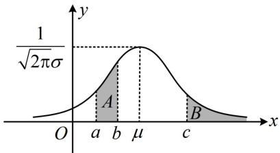
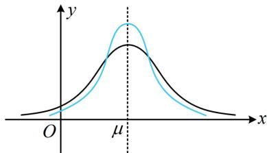

<!-- source-part:1 pages:1-7 -->

# 第 4 节 正态分布（★★☆）

## 内容提要

本节归纳正态分布有关题型，先梳理会用到的一些基础知识.

1. 正态分布的概念：设函数 $f(x) = \frac{1}{\sqrt{2\pi}\sigma} \mathrm{e}^{-\frac{(x - \mu)^2}{2\sigma^2}} (x \in \mathbf{R})$ ，其中 $\mu \in \mathbf{R}$ ， $\sigma > 0$ 为参数。若随机变量 $X$ 的概率分布密度函数为 $f(x)$ ，则称 $X$ 服从正态分布，记作 $X \sim N(\mu, \sigma^2)$ ，其中 $\mu$ 和 $\sigma^2$ 分别是 $X$ 的均值和方差。特别地，当 $\mu = 0$ ， $\sigma = 1$ 时，称随机变量 $X$ 服从标准正态分布。我们称函数 $f(x)$ 为正态密度函数，称它的图象为正态密度曲线，简称正态曲线，如图1。

  
图1

  
图2

2. 取值概率: 服从正态分布的随机变量取任何一个值的概率均为 0, 我们更关注它在某区间内取值的概率, 如上图 1, 若 $X \sim N(\mu, \sigma^2)$ , 则 $P(a \leq X \leq b)$ 等于区域 $A$ 的面积, $P(X \geq c)$ 等于区域 $B$ 的面积; 由于正态曲线关于 $x = \mu$ 对称, 所以 $P(X \geq \mu) = 0.5$ .

3. 调整参数对正态曲线的影响:

①取定 $\sigma$ ，调整 $\mu$ ，则正态曲线的形状不变，但会沿 $x$ 轴方向平移；

②取定 $\mu$ ，调整 $\sigma$ ，则正态曲线的位置不变，但形状会发生变化。若 $\sigma$ 增大，则峰值 $\frac{1}{\sqrt{2\pi}\sigma}$ 减小，结合正态曲线与 $x$ 轴围成的面积始终为 1 可知曲线会变得“矮胖”， $X$ 的取值变得更分散，如上图 2 中黑色曲线；反之，若 $\sigma$ 减小，则曲线会变得“瘦高”， $X$ 的取值变得更集中，如上图 2 中蓝色曲线。

4. 3σ 原则：若 $X \sim N(\mu, \sigma^2)$ ，则对给定的 $k \in \mathbf{N}^*$ ， $P(\mu - k\sigma \leq X \leq \mu + k\sigma)$ 是一个只与 $k$ 有关的定值。特别地，当 $k$ 取 1，2，3 时的情况在统计中有广泛的应用，尤其重要：

$$
P (\mu - \sigma \leq X \leq \mu + \sigma) \approx 0. 6 8 2 7,
$$

$$
P (\mu - 2 \sigma \leq X \leq \mu + 2 \sigma) \approx 0. 9 5 4 5,
$$

$$
P (\mu - 3 \sigma \leq X \leq \mu + 3 \sigma) \approx 0. 9 9 7 3.
$$

可以看到， $X$ 在 $[\mu - 3\sigma, \mu + 3\sigma]$ 外取值的概率只有0.0027，在实际应用中，通常认为服从正态分布 $N(\mu, \sigma^2)$ 的随机变量只取 $[\mu - 3\sigma, \mu + 3\sigma]$ 内的值.

![[高中/总复习/教辅/一数常规版2026/第12章 概率统计/模块3 离散型随机变量及其分布/第4节 正态分布/类型01_用正态曲线求概率/类型01_用正态曲线求概率.md]]
![[高中/总复习/教辅/一数常规版2026/第12章 概率统计/模块3 离散型随机变量及其分布/第4节 正态分布/类型02_正态分布在实际问题中的综合应用/类型02_正态分布在实际问题中的综合应用.md]]
![[高中/总复习/教辅/一数常规版2026/第12章 概率统计/模块3 离散型随机变量及其分布/第4节 正态分布/强化训练/强化训练.md]]
