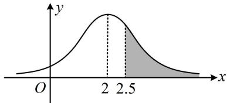

> [!faq]- 《第4节 正态分布》例题解析
>
> > [!success]- **【答案】** 0.14
>
> > [!note]- **【分析】**
> > 本题未单列分析。
>
> > [!note]- **【解析】**
> > 解析：可画正态曲线来分析，如图，求正态分布在某区间取值的概率，只需求该区间那部分的面积，由题意， $\mu = 2$ ，如图， $P(X > 2.5) = P(X > 2) - P(2 < X \leq 2.5) = 0.5 - 0.36 = 0.14.$
> >
> >
> > 
