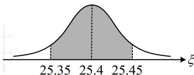

> [!faq]- 《第4节 正态分布》例题解析
>
> > [!success]- **【答案】** ACD
>
> > [!note]- **【分析】**
> > 本题未单列分析。
>
> > [!note]- **【解析】**
> > A. $P(25.35 < \xi < 25.45) = 0.8$ B. $E(X) = 2.4$ C. $D(X) = 0.48$ D. $P(X \geq 1) = 0.488$
> >
> > 解析：A 项，如图，由对称性， $P(\xi \leq 25.35) = P(\xi \geq 25.45) = 0.1$ ，
> > 所以 $P(25.35 < \xi < 25.45) = 1 - P(\xi \leq 25.35) - P(\xi \geq 25.45) = 1 - 0.1 - 0.1 = 0.8$ ，故 A 项正确；
> > B 项，要分析 3 件产品中落在 (25.35,25.45) 外的件数，需先求出 1 件产品落在该区间外的概率，
> > 随机取 1 件零件，质量指标值位于区间 (25.35,25.45) 外的概率为 0.2，所以 $X \sim B(3,0.2)$ 从而 $E(X)=3\times0.2=0.6,\quad D(X)=3\times0.2\times(1-0.2)=0.48$ 故 B 项错误，C 项正确；
> > D 项，因为 $X \sim B(3,0.2)$ ，所以 $P(X \geq 1) = 1 - P(X = 0) = 1 - C_{3}^{0} \times (1 - 0.2)^{3} = 0.488$ ，故 D 项正确.
> >
> > 
