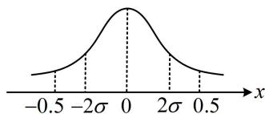

> [!faq]- 《第4节 正态分布》例题解析
>
> > [!success]- **【答案】** 32
>
> > [!note]- **【分析】**
> > 本题未单列分析。
>
> > [!note]- **【解析】**
> > 解析：$\varepsilon_{n}\sim N\left(0,\frac{2}{n}\right)\Rightarrow \mu = 0$ ， $\sigma = \sqrt{\frac{2}{n}}$ ，由题意， $P(-0.5 <   \varepsilon_n <   0.5)\geq 0.9545$ ①，
> >
> > 涉及正态分布的区间取值概率，可画正态曲线来看，
> > 如图，结合所给数据可知 $P(-2\sigma < \varepsilon_{n} < 2\sigma) = 0.9545$ 所以不等式①等价于 $(-2\sigma,2\sigma)\subseteq(-0.5,0.5)$ ，从而 $2\sigma\leq0.5$ ，故 $2\sqrt{\frac{2}{n}}\leq\frac{1}{2}$ 解得： $n \geq 32$ ，所以至少要测量32次.
> >
> > 
