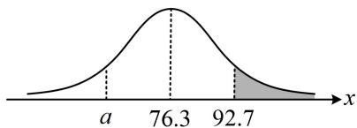

> [!faq]- 《第4节 正态分布》例题解析
>
> > [!success]- **【答案】** 59.9
>
> > [!note]- **【分析】**
> > 本题未单列分析。
>
> > [!note]- **【解析】**
> > 解析：所给数据是标准正态分布 $\eta$ 的取值概率，要求的是 $Y$ 的情况，故应先把 $\eta \leq 2.05$ 转换成 $Y$ 的范围，由 $\eta = \frac{Y - \mu}{\sigma}$ 可得 $\eta \leq 2.05$ 即为 $\frac{Y - \mu}{\sigma} \leq 2.05$ ，又 $Y \sim N(76.3, 64)$ ，所以 $\mu = 76.3$ ， $\sigma = 8$ ，故 $\frac{Y - 76.3}{8} \leq 2.05$ ，解得： $Y \leq 92.7$ ，所以 $P(\eta \leq 2.05) \approx 0.98$ 即为 $P(Y \leq 92.7) \approx 0.98$ ，故 $P(Y > 92.7) \approx 1 - 0.98 = 0.02$ ，
> >
> > 从所给的各等级的人数占比来看,原始分D等级最低分应为从低到高的2%处,故只需求出使 $P(Y \leq a) \approx 0.02$ 的a,即为估计的划线分,涉及正态分布取值概率,可画正态曲线来看,
> >
> > 如图，阴影部分的面积恰好为 0.02，所以要使 $P(Y \leq a) \approx 0.02$ ，
> >
> > 应有 $a$ 和92.7应关于76.3对称，即 $\frac{a + 92.7}{2} = 76.3$ ，解得： $a = 59.9$ 故可估计该划线分大约为59.9分.
> >
> > 
>
> > [!tip]- **【总结】**
> > 涉及正态分布算区间概率，可画正态曲线，利用其对称性和 $3\sigma$ 区间取值概率来分析即可.
