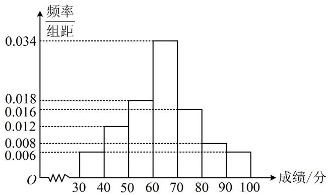
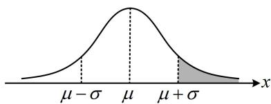

<!-- question-source:start -->
【例 3】某市为了传承发展中华优秀传统文化，组织该市中学生进行了一次文化知识有奖竞赛，竞赛奖励规则如下：得分在[70,80)内的学生获三等奖，得分在[80,90)内的学生获二等奖，得分在[90,100]内的学生获一等奖，其他学生不获奖。为了解学生对相关知识的掌握情况，随机抽取100名学生的竞赛成绩，并以此为样本绘制了样本频率分布直方图，如图。

（1）现从该样本中随机抽取两名学生的竞赛成绩，求这两名学生中恰有一名学生获奖的概率；

（2）若该市所有参赛学生的成绩 $X$ 近似服从正态分布 $N(\mu, \sigma^2)$ ，其中 $\sigma \approx 15$ ， $\mu$ 为样本平均数的估计值，利用所得正态分布模型解决以下问题：

(i) 若该市共有 10000 名学生参加了竞赛, 试估计参赛学生中成绩超过 79 分的学生数; (结果四舍五入到整数)

（ii）若从所有参赛学生中（参赛学生数大于10000）随机取3名学生进行访谈，设其中竞赛成绩在64分以上的学生数为 $\xi$ ，求 $\xi$ 的分布列和期望.

附：若随机变量 $X \sim N(\mu, \sigma^2)$ ，则 $P(\mu - \sigma < X < \mu + \sigma) \approx 0.6827$ ， $P(\mu - 2\sigma < X < \mu + 2\sigma) \approx 0.9545$ ， $P(\mu - 3\sigma < X < \mu + 3\sigma) \approx 0.9973$ .

(1) 由题意, 样本 100 人的成绩中, 获奖的有 $100 \times (0.016 + 0.008 + 0.006) \times 10 = 30$ 人, 所以抽到的两名学生中恰有一名学生获奖的概率 $P = \frac{C_{70}^{1} C_{30}^{1}}{C_{100}^{2}} = \frac{14}{33}$ .

(2) (i) (要估算成绩超过 79 分的人数, 应先求 $P(X > 79)$ , 而要求此概率, 需找到 79 与 $\mu$ 和 $\sigma$ 的关系)由题意, $\mu = 35 \times 0.06 + 45 \times 0.12 + 55 \times 0.18 + 65 \times 0.34 + 75 \times 0.16 + 85 \times 0.08 + 95 \times 0.06 = 64$ , 所以 $X \sim N(64,15^{2})$ ,如图, $P(X > 79) = P(X > \mu + \sigma) = \frac{1 - P(\mu - \sigma < X < \mu + \sigma)}{2} \approx \frac{1 - 0.6827}{2} = 0.15865$ ,

该市共有10000名学生参加了竞赛，所以参赛学生中成绩超过79分的学生数约为 $10000 \times 0.15865 \approx 1587$ 。（ii）（抽取人数远小于总人数，故可用二项分布来近似处理）

因为 $\mu = 64$ ，所以 $P(X > 64) = \frac{1}{2}$ ，故 $\xi \sim B\left(3, \frac{1}{2}\right)$ ，所以 $P(\xi = 0) = C_3^0 \times \left(1 - \frac{1}{2}\right)^3 = \frac{1}{8}$

$P(\xi = 1) = \mathrm{C}_3^1\times \frac{1}{2}\times \left(1 - \frac{1}{2}\right)^2 = \frac{3}{8},\quad P(\xi = 2) = \mathrm{C}_3^2\times \left(\frac{1}{2}\right)^2\times \left(1 - \frac{1}{2}\right) = \frac{3}{8},\quad P(\xi = 3) = \mathrm{C}_3^3\times \left(\frac{1}{2}\right)^3 = \frac{1}{8},$ 故 $\xi$ 的分布列为：

<table><tr><td>ξ</td><td>0</td><td>1</td><td>2</td><td>3</td></tr><tr><td>P</td><td> $\frac{1}{8}$ </td><td> $\frac{3}{8}$ </td><td> $\frac{3}{8}$ </td><td> $\frac{1}{8}$ </td></tr></table>

因为 $\xi \sim B\left(3, \frac{1}{2}\right)$ ，所以 $\xi$ 的期望 $E(\xi) = 3 \times \frac{1}{2} = \frac{3}{2}$ .
<!-- question-source:end -->

![[高中/总复习/教辅/一数常规版2026/第12章 概率统计/模块3 离散型随机变量及其分布/第4节 正态分布/类型02_正态分布在实际问题中的综合应用/例题/answers/Q00049746A1.md]]
