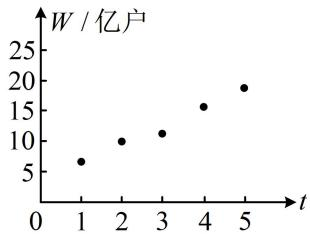

<!-- question-source:start -->
## 6. (2023·福建厦门模拟·★★★★)

移动物联网广泛应用于生产制造、公共服务、个人消费等领域. 截至 2022 年底, 我国移动物联网连接数达 18.45 亿户, 成为全球主要经济体中首个实现 “物超人” 的国家. 如图是 2018\~2022 年移动物联网连接数 $W$ 与年份代码 $t$ 的散点图, 其中年份 2018\~2022 对应的 $t$ 分别为 1\~5.

（1）根据散点图推断两个变量是否线性相关. 计算样本相关系数（精确到0.01），并推断它们的相关程度；

（2）（i）假设变量 x 与变量 Y 的 n 对观测数据为 $(x_{1}, y_{1})$ ， $(x_{2}, y_{2})$ ，…， $(x_{n}, y_{n})$ ，两个变量满足一元线性回归模型 $\left\{\begin{aligned}Y &= bx + e \\ E(e) &= 0, D(e) = \sigma^{2}\end{aligned}\right.$ （随机误差 $e_{i} = y_{i} - bx_{i}$ ）。请推导：当随机误差平方和 $Q = \sum_{i=1}^{n} e_{i}^{2}$ 取得最小值时，参数 b 的最小二乘估计；

（ii）令变量 $x = t - \overline{t}$ ， $y = w - \overline{w}$ ，则变量 $x$ 与变量 $Y$ 满足一元线性回归模型 $\left\{ \begin{array}{l} Y = bx + e \\ E(e) = 0, D(e) = \sigma^2 \end{array} \right.$ . 利用（i）中结论求 $y$ 关于 $x$ 的经验回归方程，并预测2024年移动物联网连接数.

附：样本相关系数 $r = \frac{\sum_{i=1}^{n}(t_i - \overline{t})(w_i - \overline{w})}{\sqrt{\sum_{i=1}^{n}(t_i - \overline{t})^2}\sqrt{\sum_{i=1}^{n}(w_i - \overline{w})^2}}$ ， $\sum_{i=1}^{5}(w_i - \overline{w})^2 = 76.9$ ， $\sum_{i=1}^{5}(t_i - \overline{t})(w_i - \overline{w}) = 27.2$ ， $\sum_{i=1}^{5}w_i = 60.8$ ， $\sqrt{769}\approx 27.7$
<!-- question-source:end -->

![[Q00049766A1]]
