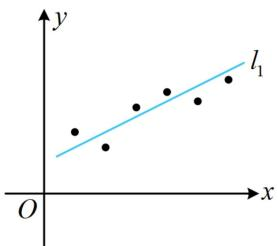
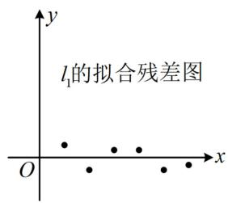
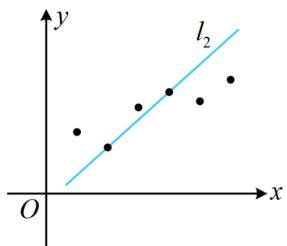
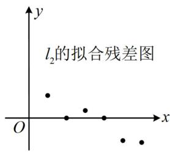
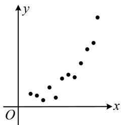
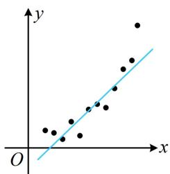
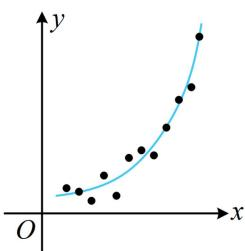

<!-- source-part:1 pages:1-12 -->

# 模块四 成对数据的统计分析

# 第1节 一元线性回归模型及其应用（★★★）

## 内容提要

本节主要归纳变量的相关关系、一元线性回归模型及其应用等内容，先梳理一些基本概念.

1. 样本相关系数 $r$ : 用于判断线性相关关系的强弱, 以及是正相关还是负相关.

① 计算公式： $r = \frac{\sum_{i=1}^{n}(x_i - \overline{x})(y_i - \overline{y})}{\sqrt{\sum_{i=1}^{n}(x_i - \overline{x})^2}\cdot\sqrt{\sum_{i=1}^{n}(y_i - \overline{y})^2}} = \frac{\sum_{i=1}^{n}x_iy_i - n\overline{x}\overline{y}}{\sqrt{\sum_{i=1}^{n}x_i^2 - n\overline{x}^2}\cdot\sqrt{\sum_{i=1}^{n}y_i^2 - n\overline{y}^2}}$ ，且按此求得的 $r$ 必

在 $[-1, 1]$ 上；

②当 $r > 0$ 时，变量 $x$ 和 $y$ 正相关，当 $r < 0$ 时，变量 $x$ 和 $y$ 负相关；

③ $|r|$ 越接近1，变量x与y的线性相关程度越大； $|r|$ 越接近0，x与y的线性相关程度越小.

2. 一元线性回归模型参数的最小二乘估计：在 $y$ 关于 $x$ 的经验回归方程 $\hat{y} = \hat{b} x + \hat{a}$ 中，参数 $\hat{b}$ 和 $\hat{a}$ 的最小二乘估计公式分别为 $\hat{b} = \frac{\sum_{i=1}^{n}(x_i - \overline{x})(y_i - \overline{y})}{\sum_{i=1}^{n}(x_i - \overline{x})^2} = \frac{\sum_{i=1}^{n}x_iy_i - n\overline{x}\overline{y}}{\sum_{i=1}^{n}x_i^2 - n\overline{x}^2}, \quad \hat{a} = \overline{y} - \hat{b}\overline{x}$ .

注：上式中 $\sum_{i=1}^{n}(x_i - \overline{x})(y_i - \overline{y}) = \sum_{i=1}^{n} x_i y_i - n\overline{x}\overline{y}$ ， $\sum_{i=1}^{n}(x_i - \overline{x})^2 = \sum_{i=1}^{n} x_i^2 - n\overline{x}^2$ ，这种公式的转换需熟悉，可能出现给的是其中一种形式，但计算时却必须用另一种的情况，下面给出 $\sum_{i=1}^{n}(x_i - \overline{x})(y_i - \overline{y}) = \sum_{i=1}^{n} x_i y_i - n\overline{x}\overline{y}$ 的证明过程.

$$
\sum_ {i = 1} ^ {n} (x _ {i} - \overline {{{{x}}}}) (y _ {i} - \overline {{{{y}}}}) = \sum_ {i = 1} ^ {n} (x _ {i} y _ {i} - \overline {{{{y}}}} x _ {i} - \overline {{{{x}}}} y _ {i} + \overline {{{{x}}}} \overline {{{{y}}}}) = \sum_ {i = 1} ^ {n} x _ {i} y _ {i} - \sum_ {i = 1} ^ {n} \overline {{{{y}}}} x _ {i} - \sum_ {i = 1} ^ {n} \overline {{{{x}}}} y _ {i} + \sum_ {i = 1} ^ {n} \overline {{{{x}}}} \overline {{{{y}}}}
$$

$$
= \sum_ {i = 1} ^ {n} x _ {i} y _ {i} - \overline {{{y}}} \sum_ {i = 1} ^ {n} x _ {i} - \overline {{{x}}} \sum_ {i = 1} ^ {n} y _ {i} + n \overline {{{x}}} \overline {{{y}}} = \sum_ {i = 1} ^ {n} x _ {i} y _ {i} - \overline {{{y}}} \cdot n \overline {{{x}}} - \overline {{{x}}} \cdot n \overline {{{y}}} + n \overline {{{x}}} \overline {{{y}}} = \sum_ {i = 1} ^ {n} x _ {i} y _ {i} - n \overline {{{x}}} \overline {{{y}}}.
$$

3. 残差: 用回归方程拟合两个变量 $x$ 和 $y$ 的关系时, 对于样本点 $(x_{1}, y_{1}), (x_{2}, y_{2}), \cdots, (x_{n}, y_{n})$ , 称观测值 $y_{i}$ 与预测值 $\hat{y}_{i}$ 的差 $y_{i} - \hat{y}_{i}$ 为相对于样本点 $(x_{i}, y_{i})$ 的残差, 其中 $i = 1, 2, \cdots, n$ . 将所有样本点的残差绘制成图形即可得到残差图, 残差点比较均匀地落在水平带状区域中, 且这样的区域越窄, 模型的拟合效果越好. 例如, 下面是用两个不同的线性回归模型 $l_{1}$ 和 $l_{2}$ 对同一组观测数据进行拟合以及对应的残差图, 对比可得线性回归模型 $l_{1}$ 的残差点分布在 $x$ 轴附近狭窄的带状区域内, 拟合效果比 $l_{2}$ 好.

4. 决定系数: $R^{2} = 1 - \frac{\sum_{i=1}^{n}(y_{i} - \hat{y}_{i})^{2}}{\sum_{i=1}^{n}(y_{i} - \overline{y})^{2}}$ , 对于已经获取的样本数据, 分母部分 $\sum_{i=1}^{n}(y_{i} - \overline{y})^{2}$ 是确定的数, 分子部分 $\sum_{i=1}^{n}(y_{i} - \hat{y}_{i})^{2}$ 是残差平方和, 决定系数 $R^{2}$ 越大, 意味着残差平方和越小, 拟合效果越好. 当要比较两种回归模型的拟合效果时, 可计算决定系数 $R^{2}$ 加以对比.

5. 非线性回归模型：通过变换（取对数、取指数、平方等）转化为线性回归模型计算，有关考题一般会给出参考数据。例如下图的这组观测数据 $(x_{1},y_{1}),(x_{2},y_{2}),\cdots,(x_{n},y_{n})$ ，若用线性回归模型 $\hat{y}=\hat{b}x+\hat{a}$ 拟合，效果就比用指数模型 $\hat{y}=\hat{a}\mathrm{e}^{\hat{b}x}$ 拟合差。而欲求模型 $\hat{y}=\hat{a}\mathrm{e}^{\hat{b}x}$ 中的 $\hat{a}$ 和 $\hat{b}$ ，可两端取自然对数，得到 $\ln\hat{y}=\hat{b}x+\ln\hat{a}$ ，若设 $\left\{\begin{aligned}\hat{z}&=\ln\hat{y}\\ \hat{c}&=\ln\hat{a}\end{aligned}\right.$ ，则 $\hat{z}=\hat{b}x+\hat{c}$ ，这样就将y关于x的非线性拟合转化成了z关于x的线性拟合。这里用到的变换，就是取对数，我们可以将观测数据 $(x_{1},y_{1}),(x_{2},y_{2}),\cdots,(x_{n},y_{n})$ 变换成 $(x_{1},z_{1}),(x_{2},z_{2}),\cdots,(x_{n},z_{n})$ ，再用最小二乘法求得z关于x的线性回归方程，最后将z换回成 $\ln y$ 即可。

![[高中/总复习/教辅/一数常规版2026/第12章 概率统计/模块4 成对数据的统计分析/第1节 一元线性回归模型及其应用/类型01_概念_计算类小题/类型01_概念_计算类小题.md]]
![[高中/总复习/教辅/一数常规版2026/第12章 概率统计/模块4 成对数据的统计分析/第1节 一元线性回归模型及其应用/类型02_线性回归综合大题/类型02_线性回归综合大题.md]]
![[高中/总复习/教辅/一数常规版2026/第12章 概率统计/模块4 成对数据的统计分析/第1节 一元线性回归模型及其应用/类型03_非线性回归综合大题/类型03_非线性回归综合大题.md]]
![[高中/总复习/教辅/一数常规版2026/第12章 概率统计/模块4 成对数据的统计分析/第1节 一元线性回归模型及其应用/强化训练/强化训练.md]]
