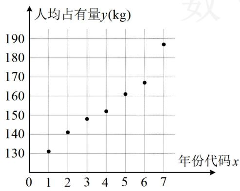
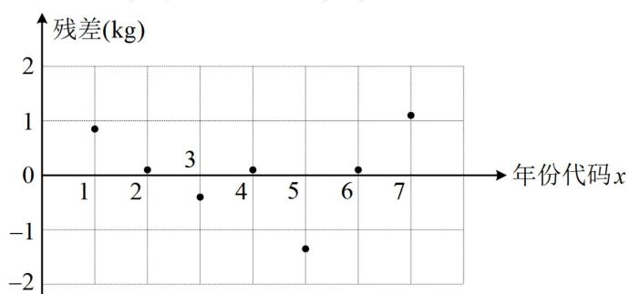

<!-- question-source:start -->
【例 6】下面给出了根据我国 2016 年\~2022 年水果人均占有量 y（单位：kg）和年份代码 x 绘制的散点图（图 1）和线性回归方程的残差图（图 2），其中 2016 年\~2022 年的年份代码 x 分别为 1\~7.

  
图1

  
图2
<!-- question-source:end -->

![[高中/总复习/教辅/一数常规版2026/第12章 概率统计/模块4 成对数据的统计分析/第1节 一元线性回归模型及其应用/类型02_线性回归综合大题/例题/answers/Q00049758A1.md]]
