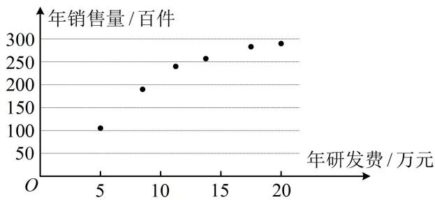

<!-- question-source:start -->
【例 7】某公司为确定下一年度投入某种产品的研发费，需了解年研发费 x（单位：万元）对年销售量 y（单位：百件）和年利润 z（单位：万元）的影响，现对近 6 年的年研发费 $x_{i}$ 和年销售量 $y_{i}(i=1,2,\cdots,6)$ 数据做了初步处理，得到下面的散点图以及一些统计量的值.

<table><tr><td> $\overline{x}$ </td><td> $\overline{y}$ </td><td> $\overline{u}$ </td><td> $\sum_{i=1}^{6}(x_i - \overline{x})^2$ </td><td> $\sum_{i=1}^{6}(u_i - \overline{u})^2$ </td><td> $\sum_{i=1}^{6}(x_i - \overline{x})(y_i - \overline{y})$ </td><td> $\sum_{i=1}^{6}(u_i - \overline{u})(y_i - \overline{y})$ </td></tr><tr><td>12.5</td><td>222</td><td>3.5</td><td>157.5</td><td>4.5</td><td>1854</td><td>270</td></tr></table>

表中 $u_{i} = \ln x_{i}$ ， $\overline{u} = \frac{1}{6}\sum_{i = 1}^{6}u_{i}$

（1）根据散点图判断 $\hat{y} = \hat{a} +\hat{b} x$ 与 $\hat{y} = \hat{c} +\hat{d}\ln x$ 哪一个更适合作为年销售量 $y$ 关于年研发费 $x$ 的回归方程类型；（给出判断即可，不必说明理由）

（2）根据
（1）的判断结果及表中数据，建立 $y$ 关于 $x$ 的回归方程；

（3）已知这种产品的年利润 $z = 0.5y - x$ ，根据
（2）的结果，求出当年研发费为多少时，年利润 $z$ 的预测值最大？

附：经验回归方程 $\hat{y} = \hat{b} x + \hat{a}$ 中的 $\hat{b}$ 和 $\hat{a}$ 的最小二乘估计公式为 $\hat{b} = \frac{\sum_{i=1}^{n}(x_i - \overline{x})(y_i - \overline{y})}{\sum_{i=1}^{n}(x_i - \overline{x})^2}, \quad \hat{a} = \overline{y} - \hat{b}\overline{x}$ .

（1）（由散点图选回归模型，就看哪种回归模型的函数图象和散点图的趋势比较接近）由散点图可知， $\hat{y} = \hat{c} + \hat{d}\ln x$ 更适合作为年销售量 $y$ 关于年研发费 $x$ 的回归方程类型.

(2) (把 $\ln x$ 看作整体 $u$ , 则 $\hat{y} = \hat{c} + \hat{d} \ln x$ 即为 $\hat{y} = \hat{c} + \hat{d} u$ , 故可按线性回归方程的最小二乘估计求 $\hat{d}$ 和 $\hat{c}$ ) 设 $u = \ln x$ , 则 $\hat{y} = \hat{c} + \hat{d} u$ , 由所给表中数据, $\hat{d} = \frac{\sum_{i=1}^{6}(u_i - \overline{u})(y_i - \overline{y})}{\sum_{i=1}^{6}(u_i - \overline{u})^2} = \frac{270}{4.5} = 60$ , $\hat{c} = \overline{y} - \hat{d} \overline{u} = 222 - 60 \times 3.5 = 12$ , 所以 $\hat{y} = 12 + 60u$ , 故 $y$ 关于 $x$ 的回归方程为 $\hat{y} = 12 + 60 \ln x$ .

（3）由
（2）可知 $z = 0.5y - x = 0.5(12 + 60\ln x) - x = 6 + 30\ln x - x$ ，所以 $z' = \frac{30}{x} - 1 = \frac{30 - x}{x}$ 从而 $z' > 0 \Leftrightarrow 0 < x < 30$ ， $z' < 0 \Leftrightarrow x > 30$ ，故 $z = 6 + 30\ln x - x$ 在 $(0,30)$ 上单调递增，在 $(30, +\infty)$ 上单调递减，所以当年研发费为30万元时，年利润 $z$ 的预测值最大.
<!-- question-source:end -->

![[高中/总复习/教辅/一数常规版2026/第12章 概率统计/模块4 成对数据的统计分析/第1节 一元线性回归模型及其应用/类型03_非线性回归综合大题/例题/answers/Q00049759A1.md]]
