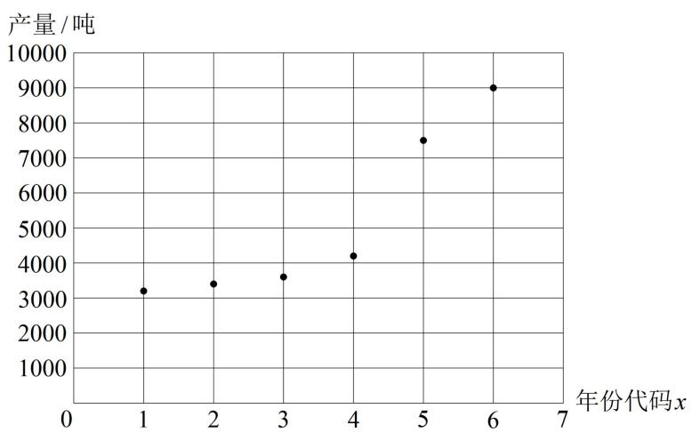

<!-- question-source:start -->
【例 8】近年来，云南省保山市龙陵县紧紧围绕打造“中国石斛之乡”的发展定位，大力发展石斛产业，该产业带动龙陵县近四分之一人口脱贫致富。2022 年 8 月，龙陵紫皮石斛获国家地理标志运用促进工程重点项目，并被评为优秀等次。在政府的大力扶持下，龙陵紫皮石斛产量逐年增长，2017 年底到 2022 年底龙陵县石斛产量统计表和散点图如下。

<table><tr><td>年份</td><td>2017</td><td>2018</td><td>2019</td><td>2020</td><td>2021</td><td>2022</td></tr><tr><td>年份代码x</td><td>1</td><td>2</td><td>3</td><td>4</td><td>5</td><td>6</td></tr><tr><td>紫皮石斛产量y（吨）</td><td>3200</td><td>3400</td><td>3600</td><td>4200</td><td>7500</td><td>9000</td></tr></table>

（1）根据散点图判断， $\hat{y} = \hat{b} x + \hat{a}$ 与 $\hat{y} = \hat{c} e^{\hat{d} x}$ （ $\hat{a}, \hat{b}, \hat{c}, \hat{d}$ 均为常数）哪一个更适合作为龙陵县紫皮石斛产量 $y$ 关于年份代码 $x$ 的回归模型？（给出判断即可，不必说明理由）

（2）经计算得下表中数据，根据
（1）中结果，求出 $y$ 关于 $x$ 的回归方程；

<table><tr><td> $\overline{x}$ </td><td> $\overline{y}$ </td><td> $\overline{u}$ </td><td> $\sum_{i=1}^{6}(x_i - \overline{x})^2$ </td><td> $\sum_{i=1}^{6}(x_i - \overline{x})(y_i - \overline{y})$ </td><td> $\sum_{i=1}^{6}(x_i - \overline{x})(u_i - \overline{u})$ </td></tr><tr><td>3.5</td><td>5150</td><td>8.46</td><td>17.5</td><td>20950</td><td>3.85</td></tr></table>

其中 $u_{i} = \ln y_{i}(i = 1,2,3,4,5,6)$

（3）龙陵县计划到2025年底实现紫皮石斛年产量达1.5万吨，根据
（2）所求得的回归方程，预测该目标是否能完成？（参考数据： $e^{9.45} \approx 12708$ ， $e^{9.67} \approx 15835$ ）

附：经验回归方程 $\hat{y} = \hat{b} x + \hat{a}$ 中的 $\hat{b}$ 和 $\hat{a}$ 的最小二乘估计公式为 $\hat{b} = \frac{\sum_{i=1}^{n}(x_i - \overline{x})(y_i - \overline{y})}{\sum_{i=1}^{n}(x_i - \overline{x})^2}, \quad \hat{a} = \overline{y} - \hat{b}\overline{x}$ .

（1）（由散点图选回归模型，就看哪种回归模型的函数图象和散点图更接近）

由散点图可知， $\hat{y} = \hat{c}\mathrm{e}^{\hat{d} x}$ 更适合作为龙陵县紫皮石斛产量 $y$ 关于年份代码 $x$ 的回归模型.

（2）（要作变换 $\hat{u} = \ln \hat{y}$ ，故先在回归方程两端取对数）由 $\hat{y} = \hat{c}\mathrm{e}^{\hat{d} x}$ 可得 $\ln \hat{y} = \ln (\hat{c}\mathrm{e}^{\hat{d} x}) = \ln \hat{c} +\hat{d} x$ 令 $\hat{u} = \ln \hat{y}$ ， $\hat{h} = \ln \hat{c}$ ，则 $\hat{u} = \hat{h} +\hat{d} x$ ，（ $u$ 关于 $x$ 即为线性回归模型，可代最小二乘估计公式算 $\hat{h}$ 和 $\hat{d}$ ）

由表中数据， $\hat{d} = \frac{\sum_{i = 1}^{6}(x_i - \overline{x})(u_i - \overline{u})}{\sum_{i = 1}^{6}(x_i - \overline{x})^2} = \frac{3.85}{17.5} = 0.22$ ， $\hat{h} = \overline{u} -\hat{d}\overline{x} = 8.46 - 0.22\times 3.5 = 7.69$

（3）2025年对应年份代码9，将 $x = 9$ 代入 $\hat{y} = \mathrm{e}^{7.69 + 0.22x}$ 可得 $\hat{y} = \mathrm{e}^{7.69 + 0.22\times 9} = \mathrm{e}^{9.67}\approx 15835 > 15000$
<!-- question-source:end -->

![[高中/总复习/教辅/一数常规版2026/第12章 概率统计/模块4 成对数据的统计分析/第1节 一元线性回归模型及其应用/类型03_非线性回归综合大题/例题/answers/Q00049760A1.md]]
