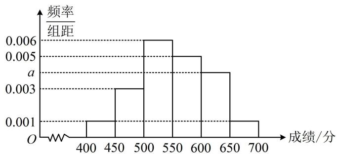

<!-- question-source:start -->
【例 2】某省级综合医院共有 1000 名医护员工参加防疫知识技能竞赛，其中男性 450 人，为了解该医院医护员工在防疫知识技能竞赛中的情况，现按性别采用分层抽样（按比例分配）的方法从中抽取 100 名医护员工的成绩（单位：分）作为样本进行统计，成绩均分布在 400\~700 分之间，根据统计结果绘制的医护员工成绩的频率分布直方图如图所示，将成绩不低于 600 分的医护员工称为优秀防疫员工.

（1）求 $a$ 的值，并估计该医院医护员工成绩的中位数 $x$ ;

（2）若样本中优秀防疫员工有女性10人，完成下面的 $2 \times 2$ 列联表，并判断根据小概率值 $\alpha = 0.05$ 的独立性检验，能否认为该医院医护员工的性别与是否为优秀防疫员工有关联？

<table><tr><td></td><td>优秀防疫员工</td><td>非优秀防疫员工</td><td>合计</td></tr><tr><td>男</td><td></td><td></td><td></td></tr><tr><td>女</td><td></td><td></td><td></td></tr><tr><td>合计</td><td></td><td></td><td></td></tr></table>

参考公式： $\chi^2 = \frac{n(ad - bc)^2}{(a + b)(c + d)(a + c)(b + d)}$ ，其中 $n = a + b + c + d$

附表:

<table><tr><td> $\alpha$ </td><td>0.10</td><td>0.05</td><td>0.01</td><td>0.005</td><td>0.001</td></tr><tr><td> ${x}_{\alpha }$ </td><td>2.706</td><td>3.841</td><td>6.635</td><td>7.879</td><td>10.828</td></tr></table>

（1）由图可知， $(0.001 + 0.003 + 0.006 + 0.005 + a + 0.001)\times 50 = 1$ ，解得： $a = 0.004$

$$
(0. 0 0 1 + 0. 0 0 3 + 0. 0 0 6) \times 5 0 = 0. 5
$$

$$
x = 5 5 0
$$

（2）由题意，抽取的100人中，男性的人数为 $\frac{450}{1000} \times 100 = 45$ ，女性的人数为 $100 - 45 = 55$

由频率分布直方图可知优秀防疫员工的人数为 $100 \times (0.004 + 0.001) \times 50 = 25$ ，其中女性10人，男性15人，所以 $2 \times 2$ 列联表如下：

<table><tr><td></td><td>优秀防疫员工</td><td>非优秀防疫员工</td><td>合计</td></tr><tr><td>男</td><td>15</td><td>30</td><td>45</td></tr><tr><td>女</td><td>10</td><td>45</td><td>55</td></tr><tr><td>合计</td><td>25</td><td>75</td><td>100</td></tr></table>

(此为独立性检验大题, 接下来的作答分三步, 第一步, 写出零假设)

零假设为 $H_0$ ：性别与是否为优秀防疫员工无关联，

（第二步，由列联表计算 $\chi^2$ 的值，并与 $\alpha$ 临界值比较） $\chi^2 = \frac{100\times(15\times 45 - 30\times 10)^2}{25\times 75\times 45\times 55}\approx 3.030 <   3.841$

（第三步，结合比较的结果作答）根据小概率值 $\alpha = 0.05$ 的独立性检验，没有充分的证据推断 $H_0$ 不成立，所以可以认为性别与是否为优秀防疫员工无关联.
<!-- question-source:end -->

![[高中/总复习/教辅/一数常规版2026/第12章 概率统计/模块4 成对数据的统计分析/第2节 独立性检验/类型02_独立性检验综合大题/例题/answers/Q00049769A1.md]]
