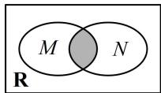
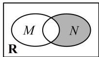
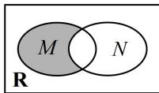
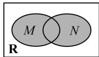

<!-- question-source:start -->
14. (2023·广东广州一模·★★)

已知集合 $M = \{x\mid x(x - 2) <   0\}$ ， $N = \{x\mid x - 1 <   0\}$ ，则下列Venn图中，阴影部分可以表示集合 $\{x\mid 1\leq x <   2\}$ 的是（）

A

C

B

  
D
<!-- question-source:end -->

![[Q00049002A1]]
