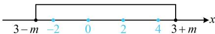

> [!faq]- 《第1节 集合》参考答案
>
> > [!success]- **【答案】** 5
>
> > [!note]- **【分析】**
> > 本题未单列分析。
>
> > [!note]- **【解析】**
> > 解析：由 $|x - 3|\leq m$ 可得 $-m\leq x - 3\leq m$
> >
> > 所以 $3 - m \leq x \leq 3 + m$ ，故 $B = [3 - m, 3 + m]$
> >
> > 因为 $A \cap B = A$ ，所以 $A \subseteq B$ ，如图，要使 $A \subseteq B$ ，
> >
> > 应有 $\left\{ \begin{array}{l}3 - m\leq -2\\ 3 + m\geq 4 \end{array} \right.$ ，解得 $m\geq 5$ ，所以 $m$ 的最小值为5.
> >
> > 
>
> > [!tip]- **【反思】**
> > $A \cup B = A \Leftrightarrow B \subseteq A$ ， $A \cap B = A \Leftrightarrow A \subseteq B$ .
