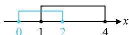

> [!faq]- 《第1节 集合》参考答案
>
> > [!success]- **【答案】** A
>
> > [!note]- **【分析】**
> > 本题未单列分析。
>
> > [!note]- **【解析】**
> > A
> > 解析： $\left|x-1\right|\leq1\Leftrightarrow-1\leq x-1\leq1\Leftrightarrow0\leq x\leq2$ ，故A=[0,2]； $\frac{x-4}{x-1}>0\Leftrightarrow(x-1)(x-4)>0\Leftrightarrow x<1$ 或 x>4，
> > 所以 $B=(-\infty,1)\cup(4,+\infty)$ ，故 $C_{U}B=[1,4]$ ;
> > 如图， $A \cap (\mathbb{C}_{U} B) = [1,2]$ .
> >
> > 
