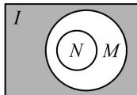

> [!faq]- 《第1节 集合》参考答案
>
> > [!success]- **【答案】** A
>
> > [!note]- **【分析】**
> > 本题未单列分析。
>
> > [!note]- **【解析】**
> > A
> > 解法 1：由 $N \cap (\complement_{I} M) = \varnothing$ 可知 N 与 M 外的部分没有公共元素，如图，结合 M, N 不相等可知应有 $N \subsetneq M$ ，所以 $M \cup N = M$ .
> > 解法 2：已知条件较为抽象，若没有思路，可尝试举具体的集合来分析选项，
> > 设 $I=\{1,2,3,4,5\}$ ， $M=\{1,2,3\}$ ，则 $C_{I}M=\{4,5\}$ ，
> > 要使 $N \cap (\complement_{I} M) = \varnothing$ ，则 N 中的元素只能在 1, 2, 3 中取，
> >
> > 又因为 $M \neq N$ ，所以 $N$ 可取 $\{1\}$
> >
> > 经检验，满足题意，此时 $M \cup N = \{1, 2, 3\} = M$ 。
> >
> > 
