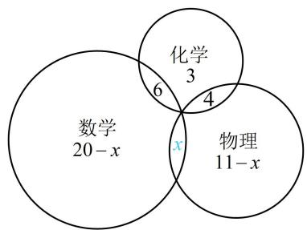

> [!faq]- 《第1节 集合》参考答案
>
> > [!success]- **【答案】** 4
>
> > [!note]- **【分析】**
> > 本题未单列分析。
>
> > [!note]- **【解析】**
> > 解析：涉及三个小组，且彼此的人员有重叠，关系较复杂，可考虑画图分析，
> >
> > 如图，设同时参加数学和物理小组的人数为 $x$ ，则只参加数学、物理小组的分别有 $20 - x$ 人， $11 - x$ 人，
> >
> > 要求 $x$ ，可由总人数为40来建立方程并求解，
> >
> > 由题意， $(20 - x) + (11 - x) + x + 6 + 4 + 3 = 40$ ，解得： $x = 4$
> >
> > 
