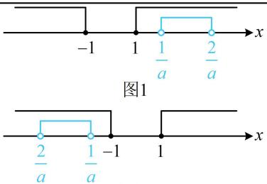

> [!faq]- 《第1节 集合》参考答案
>
> > [!success]- **【答案】** B
>
> > [!note]- **【分析】**
> > 本题未单列分析。
>
> > [!note]- **【解析】**
> > B
> >
> > 解析： $x^{2} - 1\geq 0\Rightarrow x^{2}\geq 1\Rightarrow x\leq -1$ 或 $x\geq 1$ 所以 $A = (-\infty , - 1]\cup [1, + \infty)$ 再求 $B$ ，要解 $1 < ax < 2$ ，同除以 $a$ 即可，但需讨论 $a$ 的正负，当 $a = 0$ 时， $\forall x\in \mathbf{R}$ ， $1 < ax < 2$ 都不成立，所以 $B = \emptyset$ ，满足 $B\subseteq A$ 当 $a > 0$ 时，由 $1 < ax < 2$ 可得 $\frac{1}{a} < x < \frac{2}{a}$ ，所以 $B = \left(\frac{1}{a},\frac{2}{a}\right)$ 注意到此时 $\frac{1}{a} >0$ ，从而 $B\subseteq A$ 的情况如图1，故 $\frac{1}{a}\geq 1$ ，解得： $0 < a\leq 1$ 当 $a < 0$ 时，由 $1 < ax < 2$ 可得 $\frac{2}{a} < x < \frac{1}{a}$ ，所以 $B = \left(\frac{2}{a},\frac{1}{a}\right)$ 注意到此时 $\frac{1}{a} < 0$ ，从而 $B\subseteq A$ 的情况如图2，故 $\frac{1}{a}\leq -1$ ，解得： $-1\leq a < 0$ 综上所述，实数 $a$ 的取值范围是[-1,1].
> >
> >   
> > 图2
