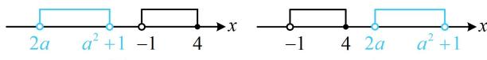

> [!faq]- 《第1节 集合》参考答案
>
> > [!success]- **【答案】** C
>
> > [!note]- **【分析】**
> > 本题未单列分析。
>
> > [!note]- **【解析】**
> > C
> >
> > 解析： $\frac{4 - x}{x + 1}\geq 0\Leftrightarrow \left\{ \begin{array}{l}(4 - x)(x + 1)\geq 0\\ x + 1\neq 0 \end{array} \right.$ ，解得： $-1 <   x\leq 4$
> >
> > 所以 $A = (-1,4]$ ；再解集合 $B$ 中的不等式，看着麻烦，其实可以因式分解。若将常数项 $2a(a^2 + 1)$ 拆成 $-2a$ 和 $-(a^2 + 1)$ ，即可产生 $-(a + 1)^2$ ，故能分解因式， $x^2 - (a + 1)^2 x + 2a(a^2 + 1) < 0 \Leftrightarrow (x - 2a)(x - a^2 - 1) < 0$ ①，要解此不等式，需比较 $2a$ 和 $a^2 + 1$ 的大小，因为 $a^2 + 1 - 2a = (a - 1)^2 \geq 0$ ，所以 $a^2 + 1 \geq 2a$ ，其中 $a^2 + 1 = 2a$ 和 $a^2 + 1 > 2a$ 对应①的解集不同，又得讨论，当 $a = 1$ 时，不等式①即为 $(x - 2)^2 < 0$ ，无解，所以 $B = \emptyset$ ，满足 $A \cap B = \emptyset$ ；当 $a \neq 1$ 时，由①可得 $2a < x < a^2 + 1$ ，所以 $B = (2a, a^2 + 1)$ ，要看 $A$ 与 $B$ 何时交集为空集，可画数轴分析，如图，要使 $A \cap B = \emptyset$ ，注意到 $a^2 + 1 > 0 > -1$ ，所以不会出现图1所示的情形，只可能是图2的情形，且端点 $2a$ 与4可以重合，重合时端点处也不是公共元素，所以 $2a \geq 4$ ，解得： $a \geq 2$ ；综上所述，实数 $a$ 的取值范围是 $\{1\} \cup [2, +\infty)$ 。
> >
> >   
> > 图1  
> > 图2
