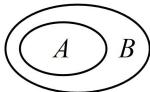
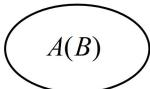
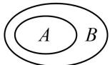
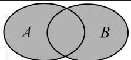
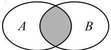
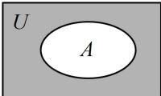

<!-- source-part:1 pages:1-12 -->

# 模块一 集合（★☆）

## 内容提要

在全国高考中，本节主要考查集合的概念、关系、运算等，下面梳理一些常考知识点.

1. 集合中元素的性质：确定性，互异性，无序性.

2. 集合间的基本关系

<table><tr><td>关系</td><td>自然语言</td><td>符号语言</td><td colspan="2">Venn图</td></tr><tr><td>子集</td><td>集合A中所有元素都在集合B中</td><td>A⊆B</td><td></td><td>或 </td></tr><tr><td>真子集</td><td>集合A是集合B的子集,且集合B中至少有一个元素不在集合A中</td><td>A⊆B</td><td colspan="2"></td></tr><tr><td>集合相等</td><td>集合A,B中的元素相同或集合A,B互为子集</td><td>A=B</td><td colspan="2">A(B)</td></tr></table>

3. 子集个数: 含有 $n$ 个元素的集合的子集有 $2^{n}$ 个, 非空子集有 $2^{n} - 1$ 个, 真子集有 $2^{n} - 1$ 个, 非空真子集有 $2^{n} - 2 (n \geq 1)$ 个.

4. 集合的基本运算

<table><tr><td>运算</td><td>自然语言</td><td>符号语言</td><td>Venn图</td></tr><tr><td>并集</td><td>由所有属于集合A或属于集合B的元素组成的集合</td><td> $A \cup B = \{ x \mid x \in A \text{ 或 } x \in B \}$ </td><td></td></tr><tr><td>交集</td><td>由属于集合A且属于集合B的所有元素组成的集合</td><td> $A \cap B = \{ x \mid x \in A \text{ 且 } x \in B \}$ </td><td></td></tr><tr><td>补集</td><td>由全集U中不属于集合A的所有元素组成的集合</td><td> $C_U A = \{ x \mid x \in U \text{ 且 } x \notin A \}$ </td><td></td></tr></table>

![[高中/总复习/教辅/一数常规版2026/第1章 集合与常用逻辑用语/模块1 集合/第1节 集合/类型01_集合的概念_集合中元素的性质/类型01_集合的概念_集合中元素的性质.md]]
![[高中/总复习/教辅/一数常规版2026/第1章 集合与常用逻辑用语/模块1 集合/第1节 集合/类型02_根据集合相等求参/类型02_根据集合相等求参.md]]
![[高中/总复习/教辅/一数常规版2026/第1章 集合与常用逻辑用语/模块1 集合/第1节 集合/类型03_根据集合间的包含关系求参/类型03_根据集合间的包含关系求参.md]]
![[高中/总复习/教辅/一数常规版2026/第1章 集合与常用逻辑用语/模块1 集合/第1节 集合/类型04_子集个数/类型04_子集个数.md]]
![[高中/总复习/教辅/一数常规版2026/第1章 集合与常用逻辑用语/模块1 集合/第1节 集合/类型05_集合的基本运算/类型05_集合的基本运算.md]]
![[高中/总复习/教辅/一数常规版2026/第1章 集合与常用逻辑用语/模块1 集合/第1节 集合/类型06_Venn_图/类型06_Venn_图.md]]
![[高中/总复习/教辅/一数常规版2026/第1章 集合与常用逻辑用语/模块1 集合/第1节 集合/类型07_集合综合题/类型07_集合综合题.md]]
![[高中/总复习/教辅/一数常规版2026/第1章 集合与常用逻辑用语/模块1 集合/第1节 集合/强化训练/强化训练.md]]
