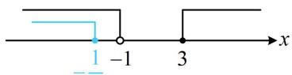
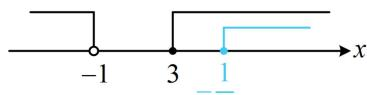

> [!faq]- 《第1节 集合》例题解析
>
> > [!success]- **【答案】** $\left[-\frac{1}{3},1\right)$
>
> > [!note]- **【分析】**
> > 本题未单列分析。
>
> > [!note]- **【解析】**
> > 解析：先解 $B$ 中的不等式 $ax + 1 \leq 0$ ，再通过数轴分析 $A$ 和 $B$ 的包含关系会比较直观，解此不等式可能要两端同除以 $a$ ，需先讨论 $a$ 的正负，
> >
> > 当 $a = 0$ 时，不等式 $ax + 1 \leq 0$ 无解，所以 $B = \emptyset$ ，满足 $B \subseteq A$ ；
> >
> > 当 $a > 0$ 时，由 $ax + 1 \leq 0$ 可得 $x \leq -\frac{1}{a}$ ，所以 $B = \left(-\infty, -\frac{1}{a}\right]$ ，
> >
> > 要分析怎样能使 $B \subseteq A$ ，可画数轴来看，注意单独考虑端点能否重合，
> >
> > $B \subseteq A$ 的情形如图1，应有 $-\frac{1}{a} < -1$ ，解得： $0 < a < 1$
> >
> > 当 $a < 0$ 时，由 $ax + 1 \leq 0$ 得 $x \geq -\frac{1}{a} \Rightarrow B = \left[-\frac{1}{a}, +\infty\right)$ ， $B \subseteq A$ 的情形如图2，应有 $-\frac{1}{a} \geq 3$ ，故 $-\frac{1}{3} \leq a < 0$ ；
> >
> > 综上所述，实数 $a$ 的取值范围是 $\left[-\frac{1}{3}, 1\right)$ .
> >
> >
> > a  
> > 
> >
> >   
> > 图1  
> > 图2
>
> > [!tip]- **【总结】**
> > 分析列举法表示的集合间的包含关系，对比两个集合中的元素即可；而对于连续取值的集合间的包含关系，常画数轴分析，需重点关注端点能否重合；另外，当子集含参时，一定注意讨论子集为空集的情况.
