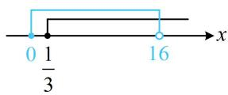

> [!faq]- 《第1节 集合》例题解析
>
> > [!success]- **【答案】** D
>
> > [!note]- **【分析】**
> > 本题未单列分析。
>
> > [!note]- **【解析】**
> > 解析：$\sqrt{x} < 4\Leftrightarrow 0\leq x < 16$ ，所以 $M = \{x\mid 0\leq x <   16\}$ ， $3x\geq 1\Leftrightarrow x\geq \frac{1}{3}$ ，所以 $N = \left\{x\Big|x\geq \frac{1}{3}\right\}$
> >
> > 求连续取值的集合的交集，可画数轴来看，如图， $M\cap N = \left\{x\left|\frac{1}{3}\leq x <   16\right.\right\} .$
> >
> >
> > 
