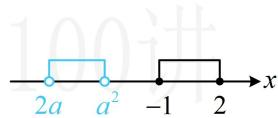
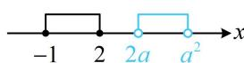

> [!faq]- 《第1节 集合》例题解析
>
> > [!success]- **【答案】** $[0, +\infty)$
>
> > [!note]- **【分析】**
> > 本题未单列分析。
>
> > [!note]- **【解析】**
> > 解析：$x^{2} - x - 2\leq 0\Leftrightarrow (x + 1)(x - 2)\leq 0\Leftrightarrow -1\leq x\leq 2$ ，所以 $A = [-1,2]$
> >
> > 怎样能使 $A \cap B = \varnothing$ ？观察发现集合 $B$ 的左右端点含参，大小不定，可能为空集，先讨论这种情况，当 $B = \varnothing$ 时， $2a \geq a^2$ ，解得： $0 \leq a \leq 2$ ，此时满足 $A \cap B = \varnothing$ ；
> >
> > 再考虑 $B$ 非空的情形，此时可画数轴来看，当 $B \neq \emptyset$ 时，首先应有 $2a < a^2$ ，解得： $a < 0$ 或 $a > 2$ ①；其次，图形应为图1或图2所示的情形，若为图1，则 $a^2 \leq -1$ ，无解；
> >
> > 若为图2，则 $2a\geq2$ ，解得： $a\geq1$ ，结合①可得a>2；
> >
> > 综上所述，实数 $a$ 的取值范围是 $[0, +\infty)$ 。
> >
> >
> >   
> > 图1
> >
> >   
> > 图2
>
> > [!tip]- **【反思】**
> > 根据交集为空集求参，一定要考虑含参集合本身为空集的情况.
