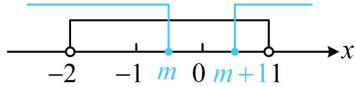
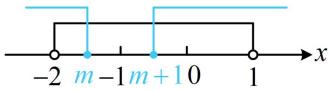

> [!faq]- 《第1节 集合》例题解析
>
> > [!success]- **【答案】** $(-2, - 1)\cup (-1,0)$
>
> > [!note]- **【分析】**
> > 本题未单列分析。
>
> > [!note]- **【解析】**
> > 解法 1: $x^{2} - (2m + 1)x + m^{2} + m < 0 \Leftrightarrow (x - m)(x - m - 1) < 0 \Leftrightarrow m < x < m + 1$ , 所以 $A = (m, m + 1)$ ，故 $\bigcap_{U} A = (-\infty, m] \cup [m + 1, +\infty)$ ，
> >
> > 再分析 $\mathsf{C}_U A$ 与 $B$ 的交集，可画数轴来看，尤其需要关注端点能否重合，
> >
> > 要使 $(\complement_U A) \cap B$ 中有且仅有1个整数，则可能的情形如图1和图2所示，
> >
> > 若为图1， $m$ 不能与-1，0重合，否则交集中有2个整数，所以 $-1 < m < 0 < m + 1 < 1$ ，故 $-1 < m < 0$ ；  
> > 若为图2， $m$ 不能与-2，-1重合，否则交集中有2个整数，所以 $-2 < m < -1 < m + 1 < 0$ ，故 $-2 < m < -1$ ；  
> > 综上所述，实数 $m$ 的取值范围是 $(-2, -1) \cup (-1, 0)$ ：
> >
> >   
> > 图1
> >
> >   
> > 图2
> >
> > 解法2: 求出 $\complement_U A = (-\infty, m] \cup [m + 1, +\infty)$ 后, 由于 $B$ 中的整数只有 $-1, 0$ , 故也可讨论它们谁在 $\complement_U A$ 中,
> >
> > 若 $\left\{ \begin{array}{l} -1 \in \complement_U A \\ 0 \notin \complement_U A \end{array} \right.$ ，则 $\left\{ \begin{array}{l} -1 \leq m \text{或} -1 \geq m + 1 \\ m < 0 < m + 1 \end{array} \right.$ ，解得： $-1 < m < 0$ ；
> >
> > 若 $\left\{ \begin{array}{l} -1 \notin \complement_U A \\ 0 \in \complement_U A \end{array} \right.$ ，则 $\left\{ \begin{array}{l} m < -1 < m + 1 \\ 0 \leq m \text{或} 0 \geq m + 1 \end{array} \right.$ ，解得： $-2 < m < -1$ ；
> >
> > 综上所述，实数 $m$ 的取值范围是 $(-2, -1) \cup (-1, 0)$ .
>
> > [!tip]- **【总结】**
> > 从上面两道题可以看出，分析列举法表示的集合的并集、交集、补集，直接从元素来看即可；而对于连续取值的集合，则常画数轴来分析，且往往需要重点关注端点.
