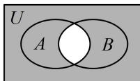

> [!faq]- 《第1节 集合》例题解析
>
> > [!success]- **【答案】** A
>
> > [!note]- **【分析】**
> > 本题未单列分析。
>
> > [!note]- **【解析】**
> > 解析：直接由 $(\complement_U A) \cup (\complement_U B) = \{1, 2, 3\}$ 分析 $A$ ， $B$ 的情况比较抽象，这时常考虑画Venn图来观察，
> >
> > 如图， $(\complement_U A) \cup (\complement_U B)$ 表示在全集 $U$ 中，把 $A \cap B$ 的部分去掉，余下的部分，即 $(\complement_U A) \cup (\complement_U B) = \complement_U (A \cap B)$ ，因为 $(\complement_U A) \cup (\complement_U B) = \{1, 2, 3\}$ ，所以 $\complement_U (A \cap B) = \{1, 2, 3\}$ ，故 $A \cap B = \{4, 5\}$ .
> >
> >
> > 
>
> > [!tip]- **【反思】**
> > 当集合间的运算较抽象时，不妨画 Venn 图来分析，往往可使问题明朗化.
