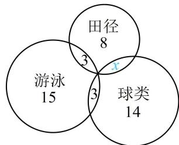

> [!faq]- 《第1节 集合》例题解析
>
> > [!success]- **【答案】** 9；3
>
> > [!note]- **【分析】**
> > 本题未单列分析。
>
> > [!note]- **【解析】**
> > 解析：题干的信息较复杂，不妨画出图形，并根据题意把各部分的人数标注出来，
> >
> > 如图, 图中的 15, 14, 8 是参加三项运动各自的总人数, 所以只参加游泳一项比赛的有 $15 - 3 - 3 = 9$ 人; 再求同时参加田径和球类比赛的人数, 观察图形发现只有这部分不知道了, 于是只需将其设为 $x$ , 就能表示出图中各小块的人数, 由共 28 人参赛来建立方程求 $x$ ,
> >
> > 由图可知只参加田径比赛的有 $8 - 3 - x = 5 - x$ 人，
> >
> > 只参加球类比赛的有 $14 - 3 - x = 11 - x$ 人，
> >
> > 所以 $9+(5-x)+(11-x)+3+3+x=28$ ，解得：x=3，
> >
> > 故同时参加田径和球类比赛的有3人.
> >
> >
> > 
>
> > [!tip]- **【反思】**
> > 涉及多个集合关系的文字题目中，常常通过画图将文字信息直观地呈现出来，使问题明朗化.
