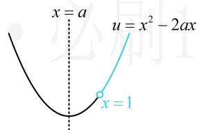

> [!faq]- 《第1节 常用逻辑用语》参考答案
>
> > [!success]- **【答案】** A
>
> > [!note]- **【分析】**
> > 本题未单列分析。
>
> > [!note]- **【解析】**
> > 解析：$f(x)$ 由 $y=\log_{2}u$ 与 $u=x^{2}-2ax$ 复合而成，可由同增异减准则分析单调性，
> > 外层的 $y=\log_{2}u$ 在 u 的范围内 $\nearrow$ ,
> > 所以要使 $f(x)$ 在 $(1,+\infty)$ 上 $\nearrow$ ,
> > 则内层的 $u = x^{2} - 2ax$ 在 $(1, +\infty)$ 上 $\nearrow$ ，如图，应有 $a \leq 1$ 所以 “ $a \leq 1$ ” 是 “ $f(x)$ 在 $(1, +\infty)$ 上 $\nearrow$ ” 的充要条件吗？不一定，还要考虑定义域的要求， $f(x)$ 在 $(1, +\infty)$ 上 $\nearrow$ 隐含了 $f(x)$ 在 $(1, +\infty)$ 上有定义，
> > 所以 $x^{2}-2ax>0$ 在 $(1,+\infty)$ 上恒成立，
> > 在 $a \leq 1$ 的条件下， $u = x^{2} - 2ax$ 在 $(1, +\infty)$ 上 $\nearrow$ ,
> > 所以只需 $1^{2}-2a\cdot1\geq0$ ，解得： $a\leq\frac{1}{2}$ 所以 “ $f(x)$ 在 $(1,+\infty)$ 上 $\nearrow$ ” 的充要条件是 “ $a\leq\frac{1}{2}$ ”，
> > 又 “ $a\leq0$ ” 是 “ $a\leq\frac{1}{2}$ ” 的充分不必要条件，所以 “ $a\leq0$ ” 是 “ $f(x)$ 在 $(1,+\infty)$ 上 $\nearrow$ ” 的充
> >
> > 
