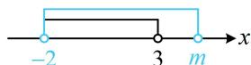

> [!faq]- 《第1节 常用逻辑用语》例题解析
>
> > [!success]- **【答案】** $(3, +\infty)$
>
> > [!note]- **【分析】**
> > 本题未单列分析。
>
> > [!note]- **【解析】**
> > 解析：不等式的解集容易写出，故可将题设的“必要不充分条件”翻译成集合的包含关系来处理，
> >
> > $x^{2} - x - 6 <   0\Leftrightarrow (x + 2)(x - 3) <   0\Leftrightarrow -2 <   x <   3$ ，记 $A = \{x\mid -2 <   x <   3\}$ ， $B = \{x\mid -2 <   x <   m\}$
> >
> > 因为 $-2 < x < m$ 是 $x^{2} - x - 6 < 0$ 的必要不充分条件等价于 $x^{2} - x - 6 < 0$ 是 $-2 < x < m$ 的充分不必要条件，所以 $A \subsetneq B$ ，如图，应有 $m > 3$ ，此处 $m$ 不能等于3，否则两个不等式应为充要条件关系.
> >
> >
> > 
>
> > [!tip]- **【反思】**
> > p 是 q 的必要不充分条件 $\Leftrightarrow q$ 是 p 的充分不必要条件 $\Leftrightarrow q$ 代表的范围 $\subsetneq p$ 代表的范围；对必要不充分条件不熟悉的同学可按此先转化为充分不必要条件，再分析参数范围.
