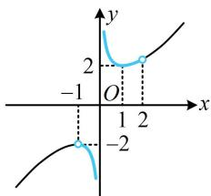

> [!faq]- 《第1节 不等式与二次函数》参考答案
>
> > [!success]- **【答案】** $(- \infty, -2) \cup [2, +\infty)$
>
> > [!note]- **【分析】**
> > 本题未单列分析。
>
> > [!note]- **【解析】**
> > 解析：只说有根，没规定几个根，考虑参变分离，
> >
> > $$
> > x ^ {2} - m x + 1 = 0 \Leftrightarrow m x = x ^ {2} + 1 \quad (1),
> > $$
> >
> > 接下来两端除以 $x$ 即可分离出 $m$ ，但需考虑 $x = 0$ 的情形，
> >
> > 当 $x = 0$ 时，方程①不成立，所以0不是方程①的解；
> >
> > 当 $x \in (-1,0) \cup (0,2)$ 时，方程①等价于 $m = x + \frac{1}{x}$ ，
> >
> > 函数 $y = x + \frac{1}{x}$ 的大致图象如图所示，
> >
> > 该函数在 $(-1,0)\cup (0,2)$ 上值域为 $(-\infty , - 2)\cup [2, + \infty)$
> >
> > 所以 m 的取值范围是 $(-∞,-2)∪[2,+∞)$ .
> >
> > 
