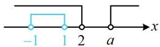
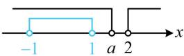

> [!faq]- 《第1节 不等式与二次函数》参考答案
>
> > [!success]- **【答案】** D
>
> > [!note]- **【分析】**
> > 本题未单列分析。
>
> > [!note]- **【解析】**
> > D
> >
> > 解析：先求解 $(x - a)(x - 2) > 0$ ， $a$ 与2的大小不定，需讨论，  
> > 记 $(x - a)(x - 2) > 0$ 的解集为 $A$ ， $B = (-1,1)$ 题干的条件等价于 $B\subsetneq A$ 当 $a = 2$ 时， $(x - a)(x - 2) > 0$ 即为 $(x - 2)^{2} > 0$ 解得： $x\neq 2$ ，所以 $A = (-\infty ,2)\cup (2, + \infty)$ ，满足 $B\subsetneq A$ 当 $a > 2$ 时， $(x - a)(x - 2) > 0\Leftrightarrow x <   2$ 或 $x > a$ 所以 $A = (-\infty ,2)\cup (a, + \infty)$ ，如图1，满足 $B\subsetneq A$
> >
> > 当 $a < 2$ 时， $(x - a)(x - 2) > 0 \Leftrightarrow x < a$ 或 $x > 2$
> >
> > 故 $A = (-\infty, a) \cup (2, +\infty)$ ，如图2，要使 $B \subsetneq A$ ，应有 $1 \leq a < 2$ ；
> >
> > 综上所述，实数 a 的取值范围是 $[1, +\infty)$ .
> >
> >   
> > 图1
> >
> >   
> > 图2
