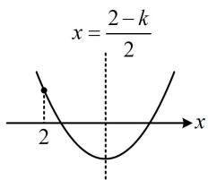

> [!faq]- 《第1节 不等式与二次函数》参考答案
>
> > [!success]- **【答案】** $(-5, - 4)$
>
> > [!note]- **【分析】**
> > 本题未单列分析。
>
> > [!note]- **【解析】**
> > 解析：规定了 $(2, +\infty)$ 上根的个数为 2，故考虑画二次函数的图象来看，
> >
> > 设 $f(x) = x^{2} + (k - 2)x + 5 - k$ ，若原方程有2个大于2的实根，则 $f(x)$ 的大致图象如图，
> >
> > 所以 $\left\{\Delta = (k - 2)^2 -4(5 - k) = k^2 -16 > 0\right.$ ，故 $-5 <   k <   - 4$
> >
> > 对称轴 $x = \frac{2 - k}{2} > 2$
> >
> > 
