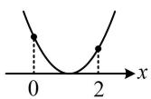
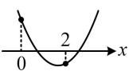
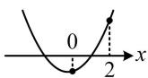
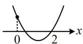

> [!faq]- 《第1节 不等式与二次函数》参考答案
>
> > [!success]- **【答案】** $[-1, +\infty) \cup \{-2\}$
>
> > [!note]- **【分析】**
> > 本题未单列分析。
>
> > [!note]- **【解析】**
> > 解析：平方项系数为字母，先讨论其等于0的情形，
> >
> > 当 $a = 0$ 时， $f(x) = 2x - 2$ ， $f(x) = 0 \Leftrightarrow x = 1$ ，满足题意；
> >
> > 当 $a \neq 0$ 时， $f(x) = 0 \Leftrightarrow ax^2 + (2 - a)x - 2 = 0 \Leftrightarrow x^2 +$
> >
> > $\frac{2 - a}{a} x - \frac{2}{a} = 0$ ，问题等价于此方程在(0,2)上有1个实根，
> >
> > 设 $g(x) = x^{2} + \frac{2 - a}{a} x - \frac{2}{a}$ ，注意到 $g(0) = -\frac{2}{a} \neq 0$
> >
> > 所以 $g(x)$ 的图象有下面四种满足要求的情形，
> >
> > 若为图1，则 $\Delta = \frac{(2 - a)^2}{a^2} +\frac{8}{a} = 0$ ，解得： $a = -2$
> >
> > 经检验，此时 $g(x)=0$ 即为 $(x-1)^{2}=0$ ，
> >
> > 解得： $x = 1$ ，满足题意；
> >
> > 若为图2或图3，此时要再分别考虑吗？不用，我们发现两种情况都只需 $g(0)$ 和 $g(2)$ 异号，故可按此统一处理，
> >
> > 所以 $g(0)g(2) = -\frac{2}{a}\left(4 + \frac{4 - 2a}{a} -\frac{2}{a}\right) <   0$
> >
> > 整理得： $a + 1 > 0$ ，故 $a > -1(a\neq 0)$
> >
> > 若为图4，则 $g(2) = 4 + \frac{4 - 2a}{a} -\frac{2}{a} = 0$ ，解得： $a = -1$
> >
> > 此时 $g(x) = x^{2} - 3x + 2$ ，由 $g(x) = 0$ 可得 $x = 1$ 或2，
> >
> > 满足 $g(x)$ 在 $(0,2)$ 上有且仅有1个零点；
> >
> > 综上所述，实数 $a$ 的取值范围是 $[-1, +\infty) \cup \{-2\}$ .
> >
> >   
> > 图1
> >
> > 
> >
> >   
> > 图3
> >
> > 图2  
> >   
> > 图4
