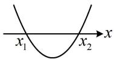
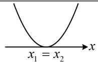
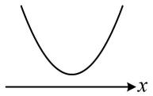

<!-- source-part:1 pages:1-6 -->

# 第二章 一元二次函数、方程与不等式

# 模块一 不等式与二次函数（★★）

## 内容提要

本节包含不等式性质、一元二次不等式、一元二次方程根的分布三部分内容.

1. 不等式的性质

①对称性： $a > b \Leftrightarrow b < a$ ；②传递性：a > b 且 $b > c \Rightarrow a > c$ ；③可加性： $a > b \Rightarrow a + c > b + c$ ；

④可乘性： $a > b$ 且 $c > 0\Rightarrow ac > bc$ ； $a > b$ 且 $c <   0\Rightarrow ac <   bc$

⑤同向可加性： $a > b$ 且 $c > d \Rightarrow a + c > b + d$

⑥同向同正可乘性： $a > b > 0$ 且 $c > d > 0 \Rightarrow ac > bd$ ；⑦可乘方性： $a > b > 0 \Rightarrow a^n > b^n (n \in \mathbf{N}^*)$

2. 二次函数与一元二次方程、不等式的解（以平方项系数 $a > 0$ 为例）

<table><tr><td></td><td> $\Delta >0$ </td><td> $\Delta = 0$ </td><td> $\Delta < 0$ </td></tr><tr><td>函数  $y=ax^{2}+bx+c$  的图象</td><td></td><td></td><td></td></tr><tr><td>方程  $ax^{2}+bx+c=0$  的实根</td><td>两个不等实根 $x_{1}$  和  $x_{2}(x_{1} < x_{2})$ </td><td>两个相等的实根 $x_{1}=x_{2}=-\frac{b}{2a}$ </td><td>没有实根</td></tr><tr><td>不等式  $ax^{2}+bx+c>0$  的解集</td><td> $\{x|x< x_{1} 或 x>x_{2}\}$ </td><td> $\left\{x\mid x\neq-\frac{b}{2a}\right\}$ </td><td>R</td></tr><tr><td>不等式  $ax^{2}+bx+c<0$  的解集</td><td> $\{x|x_{1}<x< x_{2}\}$ </td><td>∅</td><td>∅</td></tr></table>

3. 根据一元二次方程在某区间上根的情况求参:

① 若只说有根，没规定根的个数，则考虑参变分离，再对变量一侧求值域，即可得到参数的范围.

②若规定了根的个数，则常画出二次函数的图象，考虑判别式、对称轴、端点值.

![[高中/总复习/教辅/一数常规版2026/第2章 一元二次函数、方程与不等式/模块1 不等式与二次函数/第1节 不等式与二次函数/类型01_用不等式性质判断不等式是否正确/类型01_用不等式性质判断不等式是否正确.md]]
![[高中/总复习/教辅/一数常规版2026/第2章 一元二次函数、方程与不等式/模块1 不等式与二次函数/第1节 不等式与二次函数/类型02_一元二次函数_方程_不等式的关系/类型02_一元二次函数_方程_不等式的关系.md]]
![[高中/总复习/教辅/一数常规版2026/第2章 一元二次函数、方程与不等式/模块1 不等式与二次函数/第1节 不等式与二次函数/类型03_一元二次方程在某区间有实根/类型03_一元二次方程在某区间有实根.md]]
![[高中/总复习/教辅/一数常规版2026/第2章 一元二次函数、方程与不等式/模块1 不等式与二次函数/第1节 不等式与二次函数/类型04_一元二次方程在某区间实根个数已知/类型04_一元二次方程在某区间实根个数已知.md]]
![[高中/总复习/教辅/一数常规版2026/第2章 一元二次函数、方程与不等式/模块1 不等式与二次函数/第1节 不等式与二次函数/强化训练/强化训练.md]]
