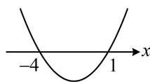

> [!faq]- 《第1节 不等式与二次函数》例题解析
>
> > [!success]- **【答案】** B
>
> > [!note]- **【分析】**
> > 本题未单列分析。
>
> > [!note]- **【解析】**
> > 解析：要解一元二次不等式，先解对应的一元二次方程，再画图来看，由 $x^{2} + 3x - 4 = 0$ 可得 $(x + 4)(x - 1) = 0$ ，解得： $x = -4$ 或1，所以二次函数 $y = x^{2} + 3x - 4$ 的大致图象如图，由图可知，不等式 $x^{2} + 3x - 4\geq 0$ 的解集为 $(- \infty , - 4]\bigcup [1, + \infty)$
> >
> > 
>
> > [!tip]- **【反思】**
> > 上面的过程给出了解一元二次不等式的基本原理, 熟练后可直接将 $x^{2} + 3x - 4$ 分解因式, 再取解集即可,本节后续题目解析将不再阐释上述原理.
