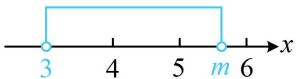
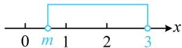

> [!faq]- 《第1节 不等式与二次函数》例题解析
>
> > [!success]- **【答案】** $[0,1)\cup (5,6]$
>
> > [!note]- **【分析】**
> > 本题未单列分析。
>
> > [!note]- **【解析】**
> > 解析：$x^{2} - (m + 3)x + 3m <   0\Leftrightarrow (x - 3)(x - m) <   0$ ，两根中 $m$ 与3的大小不确定，故需讨论，
> >
> > 当 $m = 3$ 时， $(x - 3)(x - m) < 0$ 即为 $(x - 3)^{2} < 0$ ，无解，不合题意；
> >
> > 当 $m > 3$ 时， $(x - 3)(x - m) < 0$ 的解集为 $(3, m)$ ，如图1，要使解集中有2个整数，应有 $5 < m \leq 6$ ；
> >
> > 当 $m < 3$ 时， $(x - 3)(x - m) < 0$ 的解集为 $(m,3)$ ，如图2，要使解集中有2个整数，应有 $0 \leq m < 1$ ；
> >
> > 综上所述，实数 $m$ 的取值范围是 $[0,1) \cup (5,6]$ .
> >
> >
> > 
> >
> >   
> > 图1  
> > 图2
