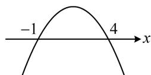

> [!faq]- 《第1节 不等式与二次函数》例题解析
>
> > [!success]- **【答案】** $\left\{x\mid x < - \frac{2}{3}\text{或} x > 1\right\}$
>
> > [!note]- **【分析】**
> > 本题未单列分析。
>
> > [!note]- **【解析】**
> > 解析：给出 $ax^2 + bx + c > 0$ 的解集是 $\{x \mid -1 < x < 4\}$ ，也就是给出了对应的方程 $ax^2 + bx + c = 0$ 的根是-1和4，可以直接将根代入方程，也可结合韦达定理建立 $a, b, c$ 的关系，这里我们不妨用韦达定理，
> >
> > 因为 $ax^2 + bx + c > 0$ 的解集是 $\{x \mid -1 < x < 4\}$ ，所以二次函数 $y = ax^2 + bx + c$ 的大致图象如图，故 $a < 0$
> >
> > 且-1和4是方程 $ax^{2}+bx+c=0$ 的两根，由韦达定理，有 $\left\{\begin{aligned}-1+4&=-\frac{b}{a}\quad①\\ -1\times4&=\frac{c}{a}\quad②\end{aligned}\right.$
> >
> > 目标不等式中有 $a, b, c$ 三个参数，可由上面两式将它们统一起来，判断出了 $a < 0$ ，故统一成 $a$
> >
> > 由①可得 $b = -3a$ ，由②可得 $c = -4a$ ，代入 $b(x^{2} - 1) + a(x + 3) + c > 0$
> >
> > 可得 $-3a(x^{2} - 1) + a(x + 3) - 4a > 0$ ，两端同除以 $-a$ 整理得： $3x^{2} - x - 2 > 0$
> >
> > 所以 $(3x + 2)(x - 1) > 0$ ，解得： $x < -\frac{2}{3}$ 或 $x > 1$
> >
> > 
>
> > [!tip]- **【总结】**
> > 一元二次函数、方程、不等式三者是紧密联系的，从一方的条件，可以推知另外两方的结论.
