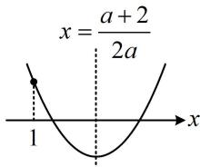

<!-- question-source:start -->
【变式2】方程 $ax^2 - (a + 2)x + 4 = 0$ 在 $(1, +\infty)$ 上有两个不相等实根，则实数 $a$ 的取值范围为 \_\_\_\_.

(1) = 1 - \frac{a + 2}{a} + \frac{4}{a} > 0 \end{array} \right.$ ③（保证对称轴右边的根大于1），

将②化简得： $a^2 - 12a + 4 > 0$ ，所以 $(a - 6)^2 > 32$ ，故 $a < 6 - 4\sqrt{2}$ 或 $a > 6 + 4\sqrt{2}$ ，由④可得 $\frac{2}{a} > 0$ ，所以 $a > 0$ ，从而③可化为 $a + 2 > 2a$ ，故 $a < 2$ ，于是 $0 < a < 2$ 综上所述，实数 $a$ 的取值范围是 $(0,6 - 4\sqrt{2})$
<!-- question-source:end -->

![[高中/总复习/教辅/一数常规版2026/第2章 一元二次函数、方程与不等式/模块1 不等式与二次函数/第1节 不等式与二次函数/类型04_一元二次方程在某区间实根个数已知/例题/answers/Q00049058A1.md]]
