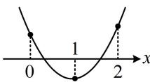

> [!faq]- 《第1节 不等式与二次函数》例题解析
>
> > [!success]- **【答案】** $\left(0,\frac{1}{4}\right)$
>
> > [!note]- **【分析】**
> > 本题未单列分析。
>
> > [!note]- **【解析】**
> > 解析：规定了两个区间上根的个数，由此容易想象二次函数图象的大致样子，故考虑画图来分析，
> >
> > 设 $f(x) = x^{2} - (m + 1)x + 4m^{2}$ ，要使原方程在(0,1)，(1,2)上各有1根，则 $f(x)$ 的大致图象应如图，
> >
> > 所以 $\left\{ \begin{array}{l} f(0) = 4m^2 > 0 \\ f
> > (1) = 4m^2 - m < 0 \\ f
> > (2) = 4m^2 - 2m + 2 > 0 \end{array} \right.$ ，解得： $0 < m < \frac{1}{4}$ .
> >
> >
> > 
