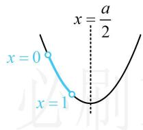

> [!faq]- 《第2节 函数的单调性与奇偶性》参考答案
>
> > [!success]- **【答案】** D
>
> > [!note]- **【分析】**
> > 本题未单列分析。
>
> > [!note]- **【解析】**
> > D
> > 解析：函数 $y = f(x)$ 由 $y = 2^{u}$ 和 $u = x(x - a)$ 复合而成，可由同增异减准则分析单调性，因为 $y = 2^{u}$ 在 R 上 ↗，所以要使 $f(x) = 2^{x(x - a)}$ 在 (0,1) 上
> > ↘，只需 $u = x(x - a)$ 在 (0,1) 上 ↘，
> > 二次函数 $u = x(x - a) = x^{2} - ax$ 的对称轴为 $x = \frac{a}{2}$ 如图，由图可知应有 $\frac{a}{2}\geq1$ ，解得： $a\geq2$ .
> >
> > 
