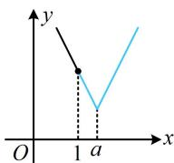

> [!faq]- 《第2节 函数的单调性与奇偶性》参考答案
>
> > [!success]- **【答案】** B
>
> > [!note]- **【分析】**
> > 本题未单列分析。
>
> > [!note]- **【解析】**
> > 函数 $f(x) = 2|x - a| + 3$ 在区间 $[1, + \infty)$ 上不单调，则 $a$ 的取值范围是（）A. $[1, + \infty)$ B. $(1, + \infty)$ C. $(- \infty ,1)$ D. $(- \infty ,1]$
> >
> > 解析： $f(x)$ 不复杂，可考虑画图分析单调性，由于有绝对值，不妨先讨论 $x$ 与 $a$ 的大小，去掉绝对值，当 $x < a$ 时， $x - a < 0$ ， $f(x) = 2(a - x) + 3 = -2x + 2a + 3$ 当 $x\geq a$ 时， $x - a\geq 0$ ， $f(x) = 2(x - a) + 3 = 2x - 2a + 3$ 所以 $f(x)$ 在 $(-\infty ,a)$ 上 $\searrow$ ，在 $[a, + \infty)$ 上 $\nearrow$ 如图，要使 $f(x)$ 在 $[1, + \infty)$ 上不单调，应有 $a > 1$ ：
> >
> > 
