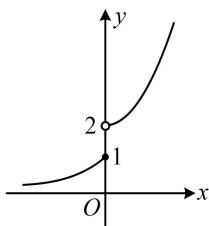

> [!faq]- 《第2节 函数的单调性与奇偶性》参考答案
>
> > [!success]- **【答案】** $(-2,2)$
>
> > [!note]- **【分析】**
> > 本题未单列分析。
>
> > [!note]- **【解析】**
> > 解析：看到函数值不等式 $f(|x|) > f(x^{2} - 2)$ ，首先考虑判断单调性，此处为分段函数，可作图看单调性，
> > 函数 $f(x)$ 的大致图象如图，由图可知 $f(x)$ 在 R 上 $\nearrow$ ,
> > 所以 $f(|x|) > f(x^{2} - 2) \Leftrightarrow |x| > x^{2} - 2$ ①，
> > 怎样解上述不等式？将 $x^{2}$ 看成 $\left|x\right|^{2}$ ，移项可分解因式，
> > 不等式①可化为 $\left|x\right|^{2}-\left|x\right|-2<0$ ，即 $(|x|+1)(|x|-2)<0$ ，
> > 因为 $|x|+1>0$ ，所以 $|x|<2$ ，故 -2<x<2。
> >
> > 
