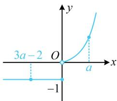

> [!faq]- 《第2节 函数的单调性与奇偶性》参考答案
>
> > [!success]- **【答案】** (0,1)
>
> > [!note]- **【分析】**
> > 本题未单列分析。
>
> > [!note]- **【解析】**
> > 解析：若代解析式解 $f(3a - 2) < f(a)$ ，则 $f(3a - 2)$ 和 $f(a)$ 该代哪段都不确定，需讨论较多情况，可考虑画图用单调性分析，函数 $f(x)$ 的大致图象如图，要使 $f(3a - 2) < f(a)$ ，
> >
> > 只需 $a$ 在 $(0, +\infty)$ 这一段，且 $3a - 2$ 在 $a$ 左侧，
> >
> > 所以 $\left\{\begin{aligned}a&>0\\ 3a&-2<a\end{aligned}\right.$ ，解得：0<a<1。
> >
> > 
