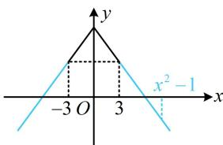

> [!faq]- 《第2节 函数的单调性与奇偶性》参考答案
>
> > [!success]- **【答案】** $(- \infty, -2) \cup (2, +\infty)$
>
> > [!note]- **【分析】**
> > 本题未单列分析。
>
> > [!note]- **【解析】**
> > 解析：偶函数给了 $y$ 轴一侧的单调性，可画出草图，用图象来分析 $f(x^{2} - 1) < f(3)$ ，
> >
> > 由题意，函数 $f(x)$ 的草图如图，
> >
> > 可以看到，图象上离 $y$ 轴越远的点，对应的函数值越小，
> >
> > 所以 $f(x^{2} - 1) < f(3) \Leftrightarrow |x^{2} - 1| > 3$ ，故 $x < -2$ 或 $x > 2$
> >
> > 
