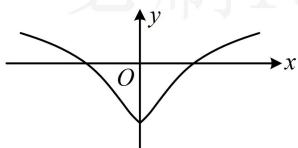

> [!faq]- 《第2节 函数的单调性与奇偶性》参考答案
>
> > [!success]- **【答案】** A
>
> > [!note]- **【分析】**
> > 本题未单列分析。
>
> > [!note]- **【解析】**
> > A
> >
> > 解析： $f(x) = \ln (1 + |x|) - \frac{1}{1 + x^2}$ 是定义在 $\mathbf{R}$ 上的偶函数，
> >
> > 虽给了解析式，但将 $f(x^{2} - x) > f(2x - 2)$ 代入解析式求解较麻烦，故考虑先判断 $y$ 轴一侧的单调性，再画草图来看，此处要求导吗？其实不用，拆分分析即可，
> > 当 $x \geq 0$ 时， $f(x) = \ln(1 + x) - \frac{1}{1 + x^2}$ 而 $y=\ln(1+x)$ 和 $y=-\frac{1}{1+x^{2}}$ 在 $[0,+\infty)$ 上都 $\nearrow$ ，
> > 所以 $f(x)$ 在 $[0,+\infty)$ 上 $\nearrow$ ，故 $f(x)$ 的草图如图，
> >
> > 可以看到，图象上离 $y$ 轴越远的点，对应的函数值越大，
> >
> > 所以 $f(x^{2}-x)>f(2x-2)\Leftrightarrow\left|x^{2}-x\right|>\left|2x-2\right|\Leftrightarrow\left\{\begin{aligned}x&\neq1\\ |x|&>2\end{aligned}\right.$
> >
> > 解得： $x < -2$ 或 $x > 2$
> >
> > 
