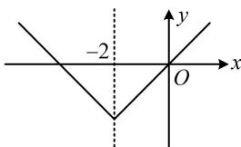

> [!faq]- 《第2节 函数的单调性与奇偶性》参考答案
>
> > [!success]- **【答案】** $(-3, +\infty)$
>
> > [!note]- **【分析】**
> > 本题未单列分析。
>
> > [!note]- **【解析】**
> > 解析：$f(x - 2)$ 是偶函数 $\Rightarrow f(x - 2)$ 的图象关于 $y$ 轴对称，
> >
> > 而 $f(x - 2)$ 的图象可由 $f(x)$ 的图象向右平移2个单位得到，所以 $f(x)$ 的图象关于直线 $x = -2$ 对称，
> >
> > 因为 $f(x)$ 在 $[-2, +\infty)$ 上 $\nearrow$ ，所以 $f(x)$ 的草图如图所示，
> >
> > 由图可知 $f(x)$ 的图象上离对称轴 $x = -2$ 越远的点，其函数值越大，故可将 $f(x + 2) > f(x)$ 翻译成 $x + 2$ 比 $x$ 离-2更远，所以 $f(x + 2) > f(x) \Leftrightarrow |x + 2 - (-2)| > |x - (-2)|$ ，
> >
> > 两端平方可解得： $x > -3$
> >
> > 
