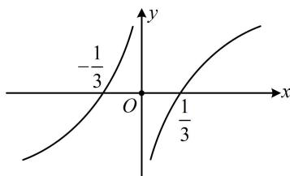

> [!faq]- 《第2节 函数的单调性与奇偶性》参考答案
>
> > [!success]- **【答案】** D
>
> > [!note]- **【分析】**
> > 本题未单列分析。
>
> > [!note]- **【解析】**
> > D
> >
> > 解析：由已知条件容易画出 $f(x)$ 的草图，故考虑画图分析不等式 $\frac{f(x)}{x^2 - 2} \leq 0$ 的解集，因为 $f(x)$ 为奇函数，且在 $(0, +\infty)$ 上 $\nearrow$ ， $f\left(\frac{1}{3}\right) = 0$ ，所以 $f(x)$ 的草图如图，怎样解不等式 $\frac{f(x)}{x^2 - 2} \leq 0$ ？注意到 $f(x)$ 和 $x^2 - 2$ 各自的正负都容易分析，故直接将其拆分成 $f(x)$ 和 $x^2 - 2$ 的正负分别考虑， $\frac{f(x)}{x^2 - 2} \leq 0 \Leftrightarrow \begin{cases} f(x) \geq 0 \\ x^2 - 2 < 0 \end{cases}$ 或 $\begin{cases} f(x) \leq 0 \\ x^2 - 2 > 0 \end{cases}$ ，若 $\begin{cases} f(x) \geq 0 \\ x^2 - 2 < 0 \end{cases}$ ，则 $\begin{cases} -\frac{1}{3} \leq x \leq 0 \text{或} x \geq \frac{1}{3}, \\ -\sqrt{2} < x < \sqrt{2} \end{cases}$ ，所以 $-\frac{1}{3} \leq x \leq 0$ 或 $\frac{1}{3} \leq x < \sqrt{2}$ ；若 $\begin{cases} f(x) \leq 0 \\ x^2 - 2 > 0 \end{cases}$ ，则 $\begin{cases} x \leq -\frac{1}{3} \text{或} 0 \leq x \leq \frac{1}{3}, \\ x < -\sqrt{2} \text{或} x > \sqrt{2} \end{cases}$ ，所以 $x < -\sqrt{2}$ ；
> >
> > 综上， $\frac{f(x)}{x^2 - 2}\leq 0$ 的解集为 $(-\infty , - \sqrt{2})\cup \left[-\frac{1}{3},0\right]\cup \left[\frac{1}{3},\sqrt{2}\right).$
> >
> > 
