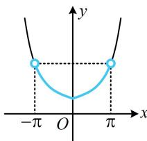

> [!faq]- 《第2节 函数的单调性与奇偶性》参考答案
>
> > [!success]- **【答案】** D
>
> > [!note]- **【分析】**
> > 本题未单列分析。
>
> > [!note]- **【解析】**
> > D
> >
> > $$
> > f (\pi) = \mathrm{e} ^ {\pi} + \sin \pi = \mathrm{e} ^ {\pi}
> > $$
> >
> > $$
> > f (2 x - 1) <   \mathrm{e} ^ {\pi}
> > $$
> >
> > $$
> > f (2 x - 1) <   f (\pi)
> > $$
> >
> > $$
> > f (x) = \mathrm{e} ^ {x} + \sin x
> > $$
> >
> > $$
> > f ^ {\prime} (x) = \mathrm{e} ^ {x} + \cos x
> > $$
> >
> > $$
> > \geq 1 + \cos x \geq 0
> > $$
> >
> > $$
> > [ 0, + \infty)
> > $$
> >
> > $$
> > - \pi <   2 x - 1 <   \pi
> > $$
> >
> > $$
> > \frac {1 - \pi}{2} <   x <   \frac {1 + \pi}{2}
> > $$
> >
> > 
>
> > [!tip]- **【反思】**
> > 本题虽然不是 $f(\dots) < f(\dots)$ 的形式，但直接代入解析式较复杂时，也可尝试看是否能化为该形式，进而用单调性处理.
