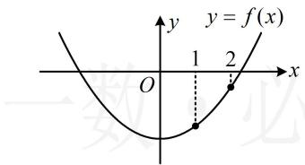
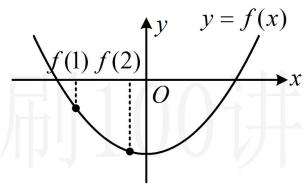
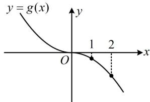
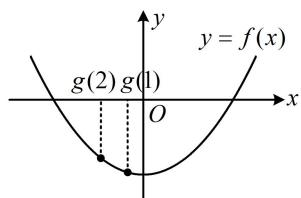

> [!faq]- 《第2节 函数的单调性与奇偶性》参考答案
>
> > [!success]- **【答案】** BD
>
> > [!note]- **【分析】**
> > 本题未单列分析。
>
> > [!note]- **【解析】**
> > BD
> >
> > 解析：给了两函数 $(- \infty, 0]$ 上的单调性，可用奇偶性得出 $[0, +\infty)$ 上的单调性，因为 $f(x)$ 是偶函数且在 $(- \infty, 0]$ 上 $\searrow$ ，所以 $f(x)$ 在 $[0, +\infty)$ 上 $\nearrow$ ①，又 $g(x)$ 是奇函数，且在 $(- \infty, 0]$ 上 $\searrow$ ，所以 $g(x)$ 在 $\mathbf{R}$ 上 $\searrow$ ②，A项，由①可得 $f(1) < f(2)$ ，但 $f(1)$ 和 $f(2)$ 的正负不明， $f(x)$ 在 $\mathbf{R}$ 上又不单调，故 $f(f(1)) < f(f(2))$ 不一定成立，
> >
> > 反例如图 1 和图 2，故 A 项错误；
> >
> > B 项， $g(x)$ 的草图如图 3，由图知 $g(2) < g(1) < 0$ ，结合 $f(x)$ 在 $(-\infty, 0]$ 上 $\searrow$ 得 $f(g(1)) < f(g(2))$ ，如图 4，故 B 项正确；C 项，分析 A 项时已得 $f(1) < f(2)$ ，
> >
> > 结合②可得 $g(f(1)) > g(f(2))$ ，故C项错误；
> >
> > D 项，分析 B 项时已得 $g(1) > g(2)$ ，
> >
> > 结合②可得 $g(g(1)) < g(g(2))$ ，故D项正确.
> >
> >   
> > 图1
> >
> > 
> >
> >   
> > 图3
> >
> > 图2  
> >   
> > 图4
