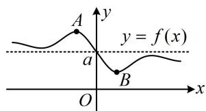

<!-- source-part:1 pages:1-12 -->

# 第2节 函数的单调性与奇偶性（★★☆）

## 内容提要

本节主要归纳函数的单调性、奇偶性相关考题，涉及的考点较多，先进行梳理.

1. 单调性的运算结论: 若函数 $f(x)$ 和 $g(x)$ 在区间 $D$ 上具有单调性, 则

①在区间 D 上，若 a > 0，则 $af(x)$ 与 $f(x)$ 单调性相同；若 a < 0，则 $af(x)$ 与 $f(x)$ 单调性相反.

② 若 $f(x)$ 和 $g(x)$ 单调性相同，则 $f(x) + g(x)$ 的单调性与它们也相同.

③ $f(x) > 0$ ， $g(x) > 0$ ，且 $f(x)$ 和 $g(x)$ 单调性相同，则 $f(x)g(x)$ 的单调性与它们也相同.

2. 复合函数的单调性判断准则：同增异减.

3. 奇函数的性质：① $f(-x) = -f(x)$ ；②图象关于原点对称；若 $x = 0$ 处有定义，则 $f(0) = 0$ .

4. 偶函数的性质：①满足 $f(-x) = f(x)$ ；②图象关于 $y$ 轴对称.

5. 常见的几个奇函数：

① $f(x) = \log_a\frac{m + x}{m - x}$ ; ② $f(x) = \log_a\frac{m - x}{m + x}$ ; ③ $f(x) = \log_a(\sqrt{m^2x^2 + 1} + mx)$ ;

④ $f(x) = \log_a(\sqrt{m^2x^2 + 1} - mx)$ ; ⑤ $f(x) = a^x - a^{-x}$ ; ⑥ $f(x) = \frac{a^x + 1}{a^x - 1}$ .

6. 奇偶性加减法结论：奇±奇=奇；偶±偶=偶；奇±偶=非奇非偶.

7. 奇偶性乘除法结论:

①奇×奇=偶；奇×偶=奇；偶×偶=偶；②奇÷奇=偶；奇÷偶=奇；偶÷偶=偶.

8. 无论 $y = f(x)$ 是什么函数，函数 $y = f(|x|)$ 和 $y = f(-|x|)$ 都是偶函数.

9. 若 $y = f(x)$ 是奇函数或偶函数，则函数 $y = |f(x)|$ 是偶函数.

10. 多项式函数 $f(x)=a_{0}+a_{1}x+a_{2}x^{2}+\cdots+a_{n}x^{n}$ 的奇偶性：

①当且仅当 $a_0 = a_2 = a_4 = \cdots = 0$ 时， $f(x)$ 为奇函数；

②当且仅当 $a_{1}=a_{3}=a_{5}=\cdots=0$ 时， $f(x)$ 为偶函数.

11. 奇函数+常数小结论：若 $g(x)$ 为奇函数，则 $g(-x) + g(x) = 0$ 对定义域内的任意实数 $x$ 恒成立，那么设 $f(x) = g(x) + a$ ，则 $f(-x) + f(x) = g(-x) + a + g(x) + a = 2a$ ；特别地，如图，因为 $g(x)$ 的图象关于原点对称，所以 $f(x)$ 的图象关于点 $(0, a)$ 对称，它必在关于 $(0, a)$ 对称的两个点处取得最大值和最小值，所以 $f(x)_{\max} + f(x)_{\min} = 2a$ .

12. 函数值不等式的解法：题干给出函数 $f(x)$ 的解析式或 $f(x)$ 满足的一些性质，让我们求解像 $f(2x - 1) < f(x^2)$ 这样的不等式，这类题有两个常用解法：

①画草图，由图解不等式；②利用单调性，转化为自变量的不等式来解.

13. 本节会多次用到指数、对数的一些运算性质，先复习一下：

①指数的运算性质： $a^r\cdot a^s = a^{r + s}$ ； $(a^r)^s = a^{rs}$ ； $(ab)^{r} = a^{r}b^{r}$

②对数的运算性质： $\log_a M + \log_a N = \log_a(MN)$ ； $\log_a M - \log_a N = \log_a \frac{M}{N}$ ；

$\log_a M^n = n \log_a M; \log_{a^m} b^n = \frac{n}{m} \log_a b; \log_a b = \frac{\log_c b}{\log_c a}; \log_a b = \frac{1}{\log_b a}; a^{\log_a N} = N.$

![[高中/总复习/教辅/一数常规版2026/第3章 函数与导数/模块1：函数概念与性质/第2节 函数的单调性与奇偶性/类型01_单调性奇偶性判断小题/类型01_单调性奇偶性判断小题.md]]
![[高中/总复习/教辅/一数常规版2026/第3章 函数与导数/模块1：函数概念与性质/第2节 函数的单调性与奇偶性/类型02_根据奇偶性求参数的值/类型02_根据奇偶性求参数的值.md]]
![[高中/总复习/教辅/一数常规版2026/第3章 函数与导数/模块1：函数概念与性质/第2节 函数的单调性与奇偶性/类型03_奇函数_常数结论的应用/类型03_奇函数_常数结论的应用.md]]
![[高中/总复习/教辅/一数常规版2026/第3章 函数与导数/模块1：函数概念与性质/第2节 函数的单调性与奇偶性/类型04_函数值不等式的解法/类型04_函数值不等式的解法.md]]
![[高中/总复习/教辅/一数常规版2026/第3章 函数与导数/模块1：函数概念与性质/第2节 函数的单调性与奇偶性/强化训练/强化训练.md]]
