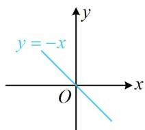
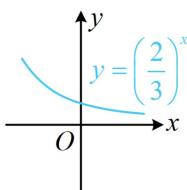
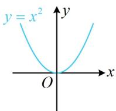
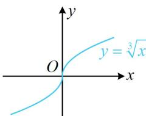

> [!faq]- 《第2节 函数的单调性与奇偶性》例题解析
>
> > [!success]- **【答案】** D
>
> > [!note]- **【分析】**
> > 本题未单列分析。
>
> > [!note]- **【解析】**
> > 解析：给的都是简单函数，想象其图象即可判断单调性，如图，只有 $f(x) = \sqrt[3]{x}$ 为增函数，故选D. 答案：D
> >
> >   
> > A
> >
> > 
> >
> > B
> >
> > 
> >
> > C
> >
> >   
> > D
